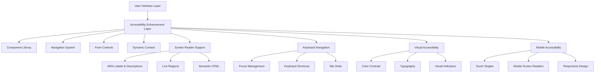

# Accessibility Enhancement Design Document

## Overview

This design document outlines the comprehensive accessibility enhancements for the KAI prediction platform to achieve WCAG 2.1 AA compliance. The design focuses on implementing semantic HTML, ARIA attributes, keyboard navigation, visual accessibility improvements, and assistive technology support while maintaining the platform's engaging, social-media-like experience.

## Architecture

### Accessibility Layer Architecture



### Implementation Strategy

The accessibility enhancements will be implemented through:

1. **Component-Level Enhancements**: Adding accessibility attributes to existing components
2. **New Accessibility Utilities**: Creating reusable accessibility helper functions and hooks
3. **Global Accessibility Styles**: Implementing focus indicators and high contrast modes
4. **Testing Infrastructure**: Automated and manual accessibility testing setup

## Components and Interfaces

### 1. Enhanced Navigation Component

**Current State Analysis**: The navigation component already has some accessibility features (aria-label, role, focus styles) but needs comprehensive enhancements.

**Enhancements Needed**:
- Improved ARIA attributes for current page indication
- Better keyboard navigation support
- Enhanced focus management
- Screen reader announcements for navigation changes

```typescript
interface AccessibleNavigationProps {
  currentPath: string
  onNavigate?: (path: string) => void
  announceNavigation?: boolean
}

interface NavigationItem {
  id: string
  icon: React.ComponentType
  label: string
  href: string
  ariaLabel?: string
  description?: string
}
```

### 2. Accessible Form Components

**New Components Needed**:
- AccessibleInput with proper labeling and error handling
- AccessibleButton with loading states and descriptions
- AccessibleSelect with keyboard navigation
- FormFieldset for grouping related form controls

```typescript
interface AccessibleInputProps {
  id: string
  label: string
  type: string
  value: string
  onChange: (value: string) => void
  error?: string
  description?: string
  required?: boolean
  ariaDescribedBy?: string
}

interface AccessibleButtonProps {
  children: React.ReactNode
  onClick: () => void
  variant?: 'primary' | 'secondary' | 'ghost'
  disabled?: boolean
  loading?: boolean
  ariaLabel?: string
  ariaDescribedBy?: string
}
```

### 3. Screen Reader Utilities

**Live Region Manager**: A utility for managing ARIA live regions for dynamic content updates.

```typescript
interface LiveRegionManager {
  announce: (message: string, priority?: 'polite' | 'assertive') => void
  announceNavigation: (pageName: string) => void
  announceError: (error: string) => void
  announceSuccess: (message: string) => void
}
```

**Screen Reader Context**: React context for managing screen reader specific features.

```typescript
interface ScreenReaderContextType {
  isScreenReaderActive: boolean
  announcePageChange: (title: string) => void
  setFocusToMain: () => void
  skipToContent: () => void
}
```

### 4. Keyboard Navigation System

**Focus Management Hook**: Custom hook for managing focus states and keyboard navigation.

```typescript
interface FocusManagementHook {
  focusableElements: HTMLElement[]
  currentFocusIndex: number
  moveFocus: (direction: 'next' | 'previous' | 'first' | 'last') => void
  trapFocus: (container: HTMLElement) => () => void
  restoreFocus: () => void
}
```

**Keyboard Shortcut Manager**: System for registering and managing keyboard shortcuts.

```typescript
interface KeyboardShortcut {
  key: string
  modifiers?: ('ctrl' | 'alt' | 'shift' | 'meta')[]
  action: () => void
  description: string
  scope?: 'global' | 'page' | 'component'
}
```

### 5. Visual Accessibility Components

**High Contrast Mode Toggle**: Component for switching between normal and high contrast themes.

**Focus Indicator System**: Consistent focus indicators across all interactive elements.

**Color Contrast Validator**: Development utility to ensure color combinations meet WCAG standards.

## Data Models

### Accessibility Preferences

```typescript
interface AccessibilityPreferences {
  userId: string
  reducedMotion: boolean
  highContrast: boolean
  fontSize: 'small' | 'medium' | 'large' | 'extra-large'
  screenReaderOptimizations: boolean
  keyboardNavigationPreferred: boolean
  announcePageChanges: boolean
  extendedTimeouts: boolean
}
```

### Accessibility Audit Results

```typescript
interface AccessibilityAuditResult {
  timestamp: Date
  page: string
  wcagLevel: 'A' | 'AA' | 'AAA'
  violations: AccessibilityViolation[]
  warnings: AccessibilityWarning[]
  passedChecks: AccessibilityCheck[]
  overallScore: number
}

interface AccessibilityViolation {
  ruleId: string
  severity: 'critical' | 'serious' | 'moderate' | 'minor'
  element: string
  description: string
  helpUrl: string
  impact: string
}
```

## Error Handling

### Accessible Error Display

**Error Announcement System**: Errors will be announced to screen readers using ARIA live regions with appropriate priority levels.

**Error Recovery Guidance**: All error messages will include specific instructions for resolution and alternative actions.

**Form Validation**: Real-time validation with accessible error messaging that doesn't interfere with screen reader navigation.

```typescript
interface AccessibleErrorHandler {
  displayError: (error: AccessibilityError) => void
  announceError: (message: string, severity: 'error' | 'warning' | 'info') => void
  provideErrorGuidance: (errorType: string) => string
  clearErrors: () => void
}

interface AccessibilityError {
  id: string
  message: string
  severity: 'critical' | 'serious' | 'moderate' | 'minor'
  element?: HTMLElement
  guidance: string
  recoveryActions: string[]
}
```

### Graceful Degradation

**Progressive Enhancement**: All accessibility features will be implemented as progressive enhancements that don't break core functionality.

**Fallback Mechanisms**: Alternative interaction methods for users who cannot use primary input methods.

**Timeout Handling**: Accessible timeout warnings with options to extend time limits.

## Testing Strategy

### Automated Testing

**Integration with Build Process**: Accessibility tests will run automatically on every build using tools like axe-core.

**Component-Level Testing**: Each component will have dedicated accessibility tests covering:
- ARIA attributes
- Keyboard navigation
- Color contrast
- Focus management

**Page-Level Testing**: Full page accessibility audits for all major user flows.

### Manual Testing

**Screen Reader Testing**: Regular testing with popular screen readers (NVDA, JAWS, VoiceOver).

**Keyboard Navigation Testing**: Complete keyboard-only navigation testing for all features.

**User Testing**: Regular testing sessions with users who rely on assistive technologies.

### Testing Infrastructure

```typescript
interface AccessibilityTestSuite {
  runAutomatedTests: (component: React.Component) => Promise<AccessibilityTestResult>
  testKeyboardNavigation: (element: HTMLElement) => Promise<KeyboardTestResult>
  testScreenReader: (page: string) => Promise<ScreenReaderTestResult>
  validateColorContrast: (colors: ColorPair[]) => ContrastTestResult
}
```

### Continuous Monitoring

**Accessibility Dashboard**: Real-time monitoring of accessibility metrics across the platform.

**Regression Detection**: Automated detection of accessibility regressions in new releases.

**User Feedback Integration**: System for collecting and addressing accessibility feedback from users.

## Implementation Phases

### Phase 1: Foundation (Weeks 1-2)
- Implement core accessibility utilities and hooks
- Enhance existing navigation component
- Set up automated testing infrastructure
- Create accessibility style guidelines

### Phase 2: Component Enhancement (Weeks 3-4)
- Enhance all form components with accessibility features
- Implement focus management system
- Add ARIA live regions for dynamic content
- Create accessible modal and dropdown components

### Phase 3: Page-Level Implementation (Weeks 5-6)
- Apply accessibility enhancements to all major pages
- Implement skip navigation links
- Add page title management
- Enhance error handling and messaging

### Phase 4: Advanced Features (Weeks 7-8)
- Implement keyboard shortcuts system
- Add high contrast mode support
- Create accessibility preferences system
- Implement advanced screen reader optimizations

### Phase 5: Testing and Refinement (Weeks 9-10)
- Comprehensive manual testing with assistive technologies
- User testing with accessibility community
- Performance optimization for accessibility features
- Documentation and training materials

## Performance Considerations

### Lazy Loading of Accessibility Features

Non-critical accessibility features will be lazy-loaded to maintain performance:
- Advanced keyboard shortcuts
- High contrast themes
- Extended screen reader descriptions

### Efficient ARIA Updates

ARIA attributes and live regions will be updated efficiently to avoid performance issues:
- Debounced live region announcements
- Selective DOM updates for ARIA attributes
- Optimized focus management

### Bundle Size Impact

Accessibility enhancements will be implemented with minimal bundle size impact:
- Tree-shakeable accessibility utilities
- Conditional loading based on user preferences
- Efficient CSS for accessibility features

## Security Considerations

### Input Validation

All accessibility-related user inputs (preferences, shortcuts) will be properly validated and sanitized.

### XSS Prevention

ARIA labels and descriptions will be properly escaped to prevent XSS attacks through accessibility attributes.

### Privacy Protection

Accessibility preferences will be stored securely and users will have control over their accessibility data.

## Browser and Device Support

### Desktop Browsers
- Chrome 90+ (with screen readers: NVDA, JAWS)
- Firefox 88+ (with screen readers: NVDA, JAWS)
- Safari 14+ (with VoiceOver)
- Edge 90+ (with Narrator, NVDA, JAWS)

### Mobile Devices
- iOS Safari 14+ (with VoiceOver)
- Android Chrome 90+ (with TalkBack)
- Samsung Internet 14+ (with TalkBack)

### Assistive Technologies
- Screen Readers: NVDA, JAWS, VoiceOver, TalkBack, Narrator
- Voice Control: Dragon NaturallySpeaking, Voice Control (iOS/macOS)
- Switch Navigation: Various switch devices and software
- Magnification: ZoomText, built-in OS magnifiers