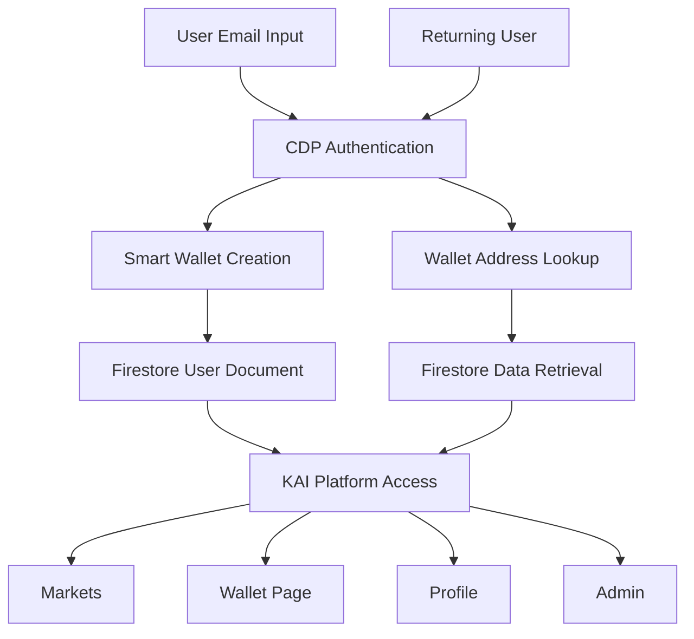
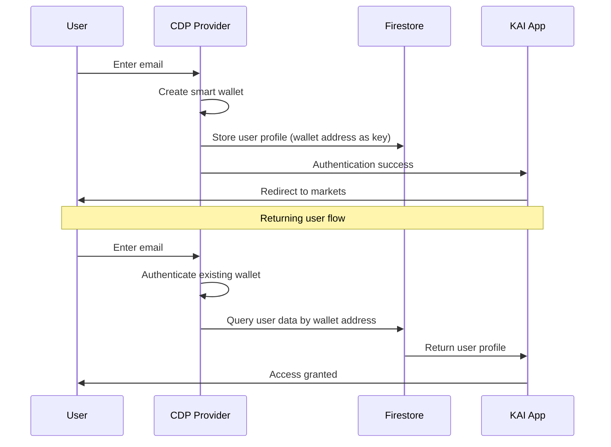

# Design Document

## Overview

The Coinbase CDP Integration transforms KAI from a Firebase Auth-based application to a Web3-native platform using Coinbase's embedded smart wallets. This design maintains all existing functionality while adding gasless transaction capabilities and seamless wallet management. The architecture uses CDP for authentication and smart wallet creation, while preserving Firestore as the primary data store with wallet addresses as user identifiers.

## Architecture

### High-Level Architecture



### Authentication Flow



### Data Migration Strategy


## Components and Interfaces

### Core Components

#### 1. CDP Provider Configuration
```typescript
// lib/cdp-config.ts
import { type Config } from "@coinbase/cdp-hooks";
import { type AppConfig } from "@coinbase/cdp-react/components/CDPReactProvider";

export const CDP_CONFIG: Config = {
  projectId: process.env.NEXT_PUBLIC_CDP_PROJECT_ID!,
  createAccountOnLogin: "evm-smart", // Smart accounts for gasless transactions
};

export const APP_CONFIG: AppConfig = {
  name: "KAI Prediction Platform",
  logoUrl: "/logo.svg",
  authMethods: ["email"], // Email-only authentication
};
```

#### 2. Updated Auth Context
```typescript
// app/auth/auth-context.tsx
interface AuthContextType {
  user: {
    address: string;        // Wallet address (primary identifier)
    email: string;         // User email
    isInitialized: boolean; // CDP initialization status
  } | null;
  isSignedIn: boolean;
  signOut: () => Promise<void>;
  loading: boolean;
}
```

#### 3. Wallet Management Component
```typescript
// app/wallet/components/wallet-dashboard.tsx
interface WalletDashboardProps {
  address: string;
  balance: string;
  transactions: Transaction[];
}
```

#### 4. User Data Service
```typescript
// lib/services/user-service.ts
class UserService {
  // Get user by wallet address instead of Firebase UID
  static async getUserByAddress(address: string): Promise<UserProfile | null>
  
  // Create user document with wallet address as key
  static async createUser(address: string, email: string): Promise<UserProfile>
  
  // Update user data using wallet address
  static async updateUser(address: string, data: Partial<UserProfile>): Promise<void>
}
```

### Interface Definitions

#### User Profile Structure
```typescript
interface UserProfile {
  address: string;           // Wallet address (document ID)
  email: string;            // User email from CDP
  displayName?: string;     // Optional display name
  avatarUrl?: string;       // Profile avatar
  createdAt: Timestamp;     // Account creation date
  lastLoginAt: Timestamp;   // Last login timestamp
  
  // Existing KAI data
  tokens: {
    available: number;
    committed: number;
    totalEarned: number;
    totalSpent: number;
  };
  
  predictions: PredictionCommitment[];
  preferences: UserPreferences;
  stats: UserStats;
}
```

#### CDP Integration Interfaces
```typescript
interface CDPUser {
  address: string;
  email: string;
  isInitialized: boolean;
}

interface WalletInfo {
  address: string;
  balance: string;
  network: string;
  isSmartAccount: boolean;
}
```

## Data Models

### Firestore Collection Structure

#### Before Migration
```
users/
  {firebaseUID}/
    profile: UserProfile
    tokens: TokenBalance
    predictions: PredictionCommitment[]
```

#### After Migration
```
users/
  {walletAddress}/
    profile: UserProfile
    tokens: TokenBalance  
    predictions: PredictionCommitment[]
```

### Migration Mapping
```typescript
interface MigrationRecord {
  oldFirebaseUID: string;
  newWalletAddress: string;
  email: string;
  migrationDate: Timestamp;
  status: 'pending' | 'completed' | 'failed';
}
```

### Database Queries Update
```typescript
// Before: Firebase UID-based queries
const userRef = doc(db, 'users', user.uid);

// After: Wallet address-based queries  
const userRef = doc(db, 'users', user.address);
```

## Error Handling

### CDP Authentication Errors
```typescript
enum CDPErrorType {
  INITIALIZATION_FAILED = 'cdp_init_failed',
  ACCOUNT_CREATION_FAILED = 'account_creation_failed',
  AUTHENTICATION_FAILED = 'auth_failed',
  WALLET_CONNECTION_FAILED = 'wallet_connection_failed',
}

interface CDPError {
  type: CDPErrorType;
  message: string;
  retryable: boolean;
}
```

### Error Recovery Strategies
- **Initialization Failures**: Retry with exponential backoff
- **Account Creation Failures**: Show user-friendly error and retry option
- **Authentication Failures**: Clear local state and redirect to login
- **Network Failures**: Queue operations for retry when connection restored

### Fallback Mechanisms
- **CDP Service Unavailable**: Show maintenance message with estimated recovery time
- **Wallet Creation Timeout**: Provide manual retry with progress indicator
- **Data Migration Failures**: Maintain rollback capability to Firebase Auth

## Testing Strategy

### Unit Testing
- **CDP Provider Configuration**: Test initialization with various configurations
- **Auth Context**: Test state management and user data handling
- **User Service**: Test CRUD operations with wallet addresses
- **Wallet Components**: Test display and interaction functionality

### Integration Testing
- **End-to-End Auth Flow**: Email signup → wallet creation → data storage
- **Migration Process**: Test data migration from Firebase UID to wallet address
- **Cross-Component Communication**: Test auth state propagation
- **API Authentication**: Test server-side CDP token verification

### User Acceptance Testing
- **Signup Flow**: New user creates account and accesses markets
- **Login Flow**: Returning user authenticates and sees existing data
- **Wallet Functionality**: User can view balance and transaction history
- **Mobile Experience**: All flows work on mobile devices

### Performance Testing
- **CDP Initialization Time**: Measure and optimize provider setup
- **Authentication Speed**: Compare with previous Firebase Auth performance
- **Database Query Performance**: Test wallet address-based queries
- **Concurrent User Load**: Test system under multiple simultaneous authentications

### Security Testing
- **Token Validation**: Verify CDP authentication tokens are properly validated
- **Data Access Control**: Ensure users can only access their own data
- **Wallet Address Verification**: Confirm wallet addresses cannot be spoofed
- **Session Management**: Test proper session cleanup on logout

## Implementation Phases

### Phase 1: Foundation (Core CDP Integration)
- Add CDP provider to application layout
- Create basic authentication context using CDP hooks
- Build test signup page for validation
- Implement wallet address-based user creation

### Phase 2: Authentication Migration
- Update auth context to use CDP instead of Firebase Auth
- Modify all components using authentication
- Update API routes for CDP token verification
- Test authentication flow end-to-end

### Phase 3: Data Layer Updates
- Update all database queries to use wallet addresses
- Implement user service with wallet address keys
- Create data migration utilities
- Test data access patterns

### Phase 4: Wallet Interface
- Build comprehensive wallet dashboard page
- Implement transaction history display
- Add wallet management features
- Update navigation to include wallet access

### Phase 5: Migration and Cleanup
- Execute user data migration for existing users
- Remove Firebase Auth dependencies
- Comprehensive testing and bug fixes
- Documentation and deployment

## Security Considerations

### Authentication Security
- **CDP Token Validation**: All API routes must validate CDP authentication tokens
- **Session Management**: Implement proper session timeout and cleanup
- **Email Verification**: Leverage CDP's built-in email verification
- **Rate Limiting**: Implement rate limiting on authentication endpoints

### Data Security
- **Wallet Address Validation**: Verify wallet addresses are valid Ethereum addresses
- **Access Control**: Users can only access data associated with their wallet address
- **Data Encryption**: Sensitive user data encrypted at rest in Firestore
- **Audit Logging**: Log all authentication and data access events

### Smart Contract Security
- **Gasless Transactions**: Ensure sponsored transactions cannot be abused
- **Transaction Limits**: Implement reasonable limits on transaction frequency
- **Network Security**: Use secure RPC endpoints for blockchain interactions
- **Wallet Permissions**: Limit smart wallet permissions to necessary operations

## Performance Optimizations

### CDP Integration
- **Lazy Loading**: Load CDP provider only when needed
- **Connection Pooling**: Reuse CDP connections where possible
- **Caching**: Cache user authentication state locally
- **Preloading**: Preload wallet data during authentication

### Database Optimization
- **Indexing**: Create indexes on wallet address fields
- **Query Optimization**: Optimize Firestore queries for wallet address lookups
- **Batch Operations**: Use batch writes for related data updates
- **Connection Management**: Optimize Firestore connection usage

### User Experience
- **Progressive Loading**: Show UI while wallet data loads
- **Offline Support**: Cache essential data for offline access
- **Error Recovery**: Graceful handling of network failures
- **Loading States**: Clear loading indicators for all async operations

## Monitoring and Analytics

### Key Metrics
- **Authentication Success Rate**: Track CDP authentication success/failure rates
- **Wallet Creation Time**: Monitor time to create new smart wallets
- **User Migration Success**: Track successful data migrations
- **Error Rates**: Monitor and alert on authentication errors

### Logging Strategy
- **Authentication Events**: Log all login/logout events with wallet addresses
- **Error Tracking**: Comprehensive error logging with context
- **Performance Metrics**: Track response times for key operations
- **User Behavior**: Analytics on wallet usage patterns

### Alerting
- **High Error Rates**: Alert when authentication failures exceed threshold
- **Performance Degradation**: Alert on slow response times
- **Migration Issues**: Alert on data migration failures
- **Service Availability**: Monitor CDP service availability