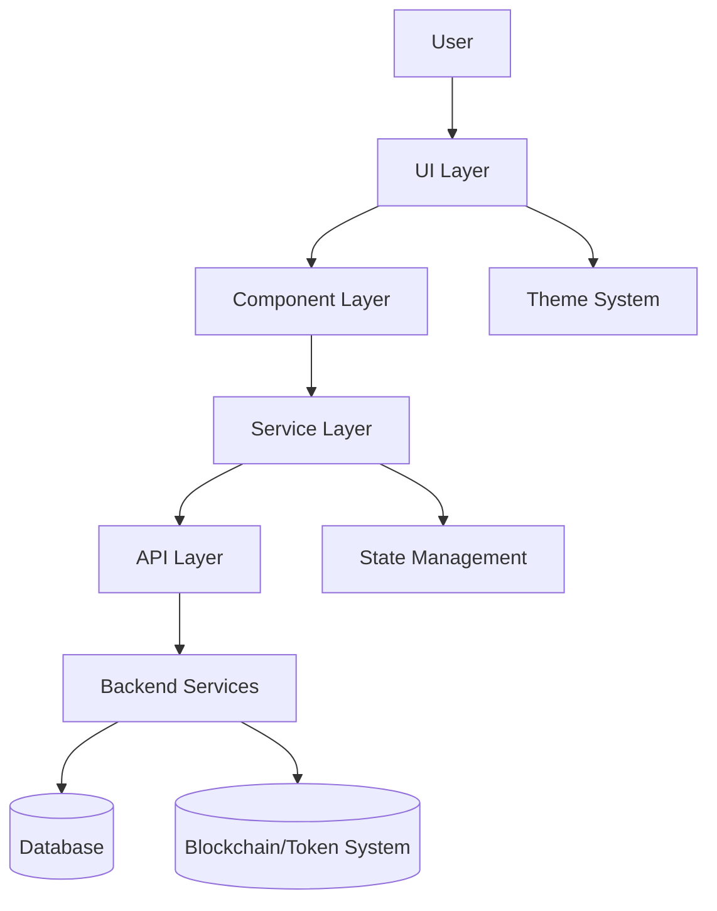
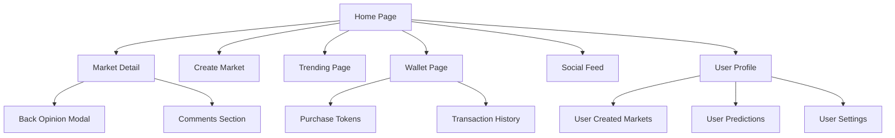
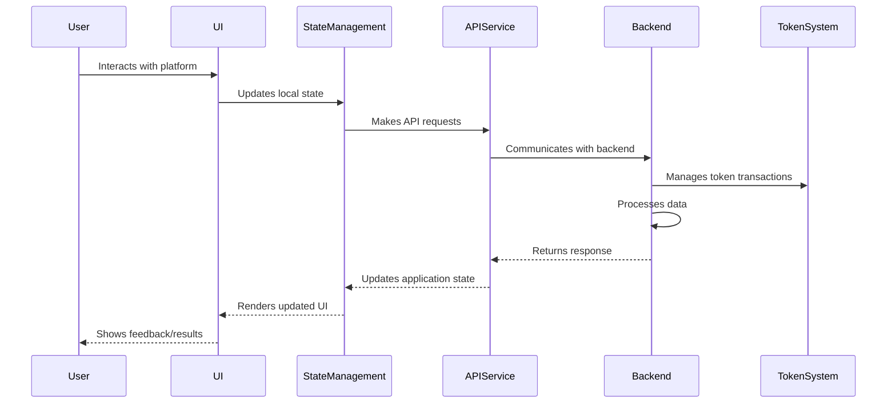
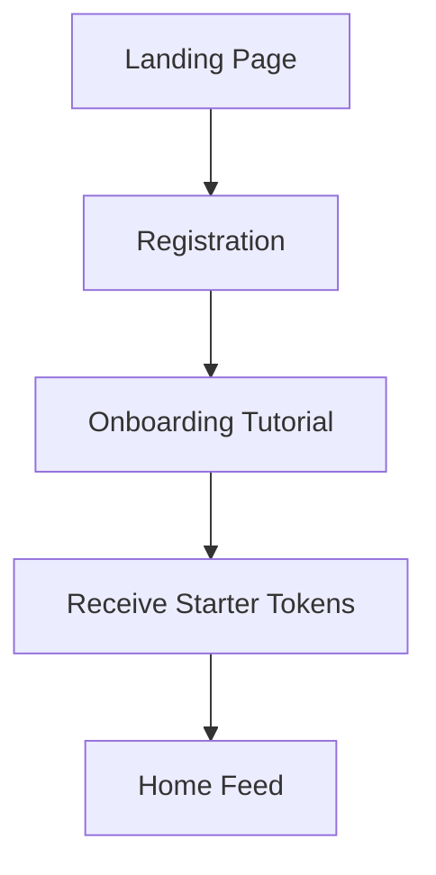
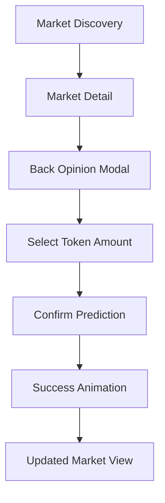
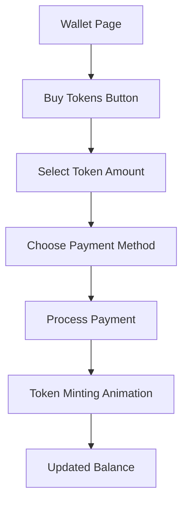

# KAI Prediction Platform Design Document

## Overview

KAI is a prediction platform specifically designed for women, reimagining the traditional prediction market experience to feel more like engaging with reality TV and social media. The platform allows users to purchase tokens and use them to participate in or create prediction markets around trending topics, cultural events, and social phenomena. By focusing on social engagement, shareable content, and an intuitive user experience, KAI aims to attract women who enjoy reality TV and pop culture but may be put off by traditional gambling platforms.

This design document outlines the architecture, components, data models, and implementation strategy for the KAI prediction platform, based on the requirements document.

## Architecture

KAI will be built as a Next.js application with a client-side focus, leveraging React for the UI components and state management. The application will follow a modular architecture with clear separation of concerns.

### High-Level Architecture



### Technology Stack

- **Frontend**: Next.js 15+, React 19+, TypeScript
- **UI Components**: Existing component library (shadcn/ui with Radix UI primitives)
- **Styling**: Tailwind CSS with custom theme
- **State Management**: React Context API and hooks
- **API Communication**: Fetch API with custom service wrappers
- **Authentication**: To be determined based on backend implementation
- **Token System**: Smart contract integration (implementation details to be determined)

## Components and Interfaces

### Core Components

1. **Authentication Components**
   - Registration Form
   - Login Form
   - Onboarding Flow
   - Profile Management

2. **Wallet Components**
   - Token Balance Display
   - Token Purchase Interface
   - Transaction History
   - Reward Animations

3. **Market Components**
   - Market Creation Interface
   - Market Discovery and Browsing
   - Market Detail View
   - Prediction Interface ("Back Opinion")

4. **Social Components**
   - Comment Section
   - Sharing Interface
   - Social Engagement Metrics
   - User Interaction Elements

5. **AI Trend Components**
   - Trending Topics Display
   - AI-Generated Market Suggestions
   - Trend Analysis Visualizations

### Page Structure



### Component Interfaces

#### Market Interface

```typescript
interface Market {
  id: string;
  title: string;
  description: string;
  category: string;
  creator: User;
  creatorRewardPercentage: number;
  options: PredictionOption[];
  startDate: Date;
  endDate: Date;
  status: 'active' | 'resolved' | 'cancelled';
  totalTokens: number;
  participants: number;
  comments: Comment[];
  vibeScore: number; // Engagement metric
  trending: boolean;
  tags: string[];
}

interface PredictionOption {
  id: string;
  name: string;
  description?: string;
  imageUrl?: string;
  tokensAllocated: number;
  percentage: number;
  color: string;
}
```

#### User Interface

```typescript
interface User {
  id: string;
  username: string;
  displayName: string;
  profileImage?: string;
  tokenBalance: number;
  createdMarkets: Market[];
  predictions: UserPrediction[];
  followers: number;
  following: number;
  joinDate: Date;
}

interface UserPrediction {
  id: string;
  market: Market;
  option: PredictionOption;
  tokensAllocated: number;
  predictionDate: Date;
  potentialWin: number;
  status: 'active' | 'won' | 'lost';
}
```

#### Transaction Interface

```typescript
interface Transaction {
  id: string;
  user: User;
  type: 'purchase' | 'backed' | 'won' | 'created' | 'reward';
  amount: number;
  description: string;
  date: Date;
  status: 'pending' | 'completed' | 'failed';
  marketId?: string;
  optionId?: string;
}
```

## Data Models

### Core Data Models

1. **User Model**
   - Personal information
   - Authentication details
   - Token balance
   - Activity history
   - Social connections

2. **Market Model**
   - Market details
   - Prediction options
   - Timeline information
   - Creator information
   - Engagement metrics

3. **Prediction Model**
   - User's prediction choice
   - Token allocation
   - Timestamp
   - Status and outcome

4. **Transaction Model**
   - Transaction type
   - Token amount
   - Timestamp
   - Related market/prediction

5. **Comment Model**
   - Content
   - Author
   - Timestamp
   - Engagement metrics

### Data Flow



## Error Handling

### Error Types

1. **Authentication Errors**
   - Invalid credentials
   - Session expiration
   - Registration issues

2. **Transaction Errors**
   - Insufficient tokens
   - Payment processing failures
   - Token minting issues

3. **Market Interaction Errors**
   - Market closed or resolved
   - Invalid prediction amount
   - Market creation failures

4. **Network Errors**
   - API connectivity issues
   - Timeout errors
   - Data synchronization problems

### Error Handling Strategy

- **User-Facing Errors**: Friendly error messages with clear actions
- **Logging**: Comprehensive error logging for debugging
- **Retry Mechanism**: Automatic retry for transient errors
- **Fallback UI**: Graceful degradation when services are unavailable
- **Error Boundaries**: React error boundaries to prevent UI crashes

## Testing Strategy

### Testing Levels

1. **Unit Testing**
   - Component testing with React Testing Library
   - Service and utility function tests
   - State management tests

2. **Integration Testing**
   - Component interaction tests
   - API integration tests
   - State management integration

3. **End-to-End Testing**
   - User flow testing
   - Critical path testing (registration, token purchase, prediction)
   - Cross-browser compatibility

### Test Coverage Goals

- 80%+ coverage for core business logic
- 70%+ coverage for UI components
- 90%+ coverage for critical user flows (token purchase, prediction)

## User Experience Design

### Design Principles

1. **Non-Gambling Focus**
   - Use language focused on "predictions" and "opinions" rather than "bets"
   - Frame outcomes as "insights" rather than "wins/losses"
   - Design visual elements that feel social and entertainment-focused

2. **Social Engagement**
   - Prioritize social interactions and community features
   - Make sharing and commenting prominent
   - Highlight user participation and community trends

3. **Visual Appeal**
   - Use a color palette appealing to the target demographic
   - Incorporate engaging animations and visual feedback
   - Create a modern, clean interface that feels premium

### Key User Flows

#### User Onboarding Flow



#### Market Participation Flow



#### Token Purchase Flow



## Implementation Considerations

### Mobile-First Approach

The application will be designed with a mobile-first approach, ensuring optimal experience on smartphones where the target audience is most likely to engage with the platform.

### Performance Optimization

- Implement code splitting for faster initial load times
- Optimize image loading and processing
- Use efficient state management to minimize re-renders
- Implement virtualization for long lists

### Accessibility

- Ensure WCAG 2.1 AA compliance
- Implement proper semantic HTML
- Provide appropriate color contrast
- Support keyboard navigation
- Test with screen readers

### Internationalization

While the initial focus will be on the primary market, the application will be designed with internationalization in mind:

- Implement i18n framework
- Separate text content from code
- Support right-to-left languages where applicable
- Consider cultural differences in UI design

## Security Considerations

### User Data Protection

- Implement proper authentication and authorization
- Encrypt sensitive user data
- Follow data protection regulations
- Implement secure session management

### Token System Security

- Implement secure token minting and transactions
- Provide transaction verification and history
- Implement fraud detection mechanisms
- Regular security audits of token system

## Future Expansion

### Potential Future Features

1. **Enhanced AI Integration**
   - Personalized market recommendations
   - Predictive analytics for users
   - Automated trend detection and market creation

2. **Advanced Social Features**
   - User groups and communities
   - Private prediction markets
   - Enhanced social sharing capabilities

3. **Expanded Reward System**
   - Loyalty program
   - Achievement badges
   - Special events and competitions

4. **Content Partnerships**
   - Integration with reality TV shows
   - Celebrity-created markets
   - Brand partnerships for sponsored markets