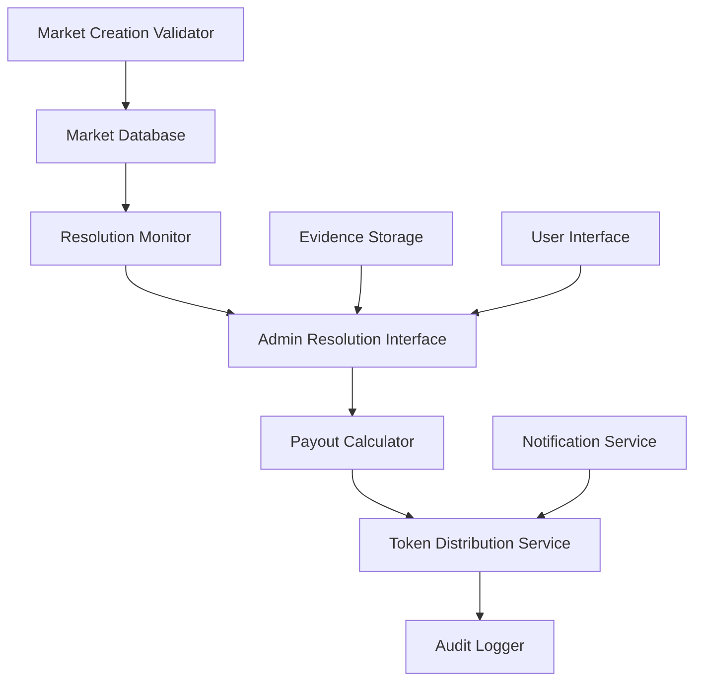

# KAI Market Resolution System - Design Document

## Overview

The KAI Market Resolution System provides a comprehensive solution for resolving prediction markets and distributing payouts fairly among winners. The system enforces strict market creation criteria to ensure all markets can be definitively resolved, implements a proportional payout algorithm, and provides administrators with tools to resolve markets with proper evidence and audit trails.

**Key Design Principles:**
- **Verifiable Outcomes**: All markets must have objectively determinable results
- **Proportional Fairness**: Winners share the total pool based on their stake proportion
- **Evidence-Based**: All resolutions require documented proof and reasoning
- **Automated Distribution**: Payouts are calculated and distributed automatically
- **Audit Trail**: Complete record of resolution decisions and evidence

## Architecture

### System Components



### Data Flow

1. **Market Creation**: Validation engine ensures resolvability criteria
2. **Market Monitoring**: System tracks markets approaching end dates
3. **Resolution Trigger**: Markets past end date enter resolution queue
4. **Admin Resolution**: Administrators review evidence and select winners
5. **Payout Calculation**: Automated proportional distribution calculation
6. **Token Distribution**: Automatic balance updates for all winners
7. **Audit Recording**: Complete evidence and decision trail storage

## Components and Interfaces

### Market Creation Rules

### ✅ Good Markets (Resolvable)
Markets must have:
- **Clear end date** (specific date/time when outcome is known)
- **Definitive outcome** (only ONE option can be true)
- **Verifiable result** (can be proven with evidence)

**Examples:**
- "Will Drake release an album before December 31, 2024?" (Yes/No)
- "Will Taylor Swift announce tour dates by March 1, 2025?" (Yes/No)  
- "Which artist will have #1 album in Q1 2025?" (Drake/Taylor/Kendrick/Other)

### ❌ Bad Markets (Not Allowed)
- Subjective opinions: "Is Drake the best rapper?" ❌
- No clear end date: "Will Drake ever tour again?" ❌
- Ambiguous outcomes: "Will Drake have a good year?" ❌
- Multiple outcomes possible: "Will Drake release music AND tour?" ❌

## Market Resolution Logic

### 1. Payout Calculation (Winners Split Pool After House + Creator Fees)

```typescript
interface ResolutionPayout {
  userId: string
  optionId: string
  tokensStaked: number
  payout: number
  profit: number
}

interface CreatorPayout {
  userId: string // Market creator
  fee: number
  percentage: number // 1-5% configurable
}

interface HousePayout {
  fee: number
  percentage: number // Always 5%
}

function calculatePayouts(
  market: Market, 
  winningOptionId: string,
  creatorFeePercentage: number = 0.02 // Default 2%, configurable 1-5%
): { winnerPayouts: ResolutionPayout[], creatorPayout: CreatorPayout, housePayout: HousePayout } {
  const winningOption = market.options.find(opt => opt.id === winningOptionId)
  const totalMarketPool = market.options.reduce((sum, opt) => sum + opt.totalTokensStaked, 0)
  const totalWinnerTokens = winningOption.totalTokensStaked
  
  // Calculate house fee (always 5% of total pool)
  const houseFeePercentage = 0.05 // 5%
  const houseFee = Math.floor(totalMarketPool * houseFeePercentage)
  
  // Calculate creator fee (1-5% configurable of total pool)
  const creatorFee = Math.floor(totalMarketPool * creatorFeePercentage)
  
  // Remaining pool for winners after both fees
  const winnerPool = totalMarketPool - houseFee - creatorFee
  
  // Get all users who bet on the winning option
  const winners = getUserBets(market.id, winningOptionId)
  
  const winnerPayouts = winners.map(bet => {
    // Winner's share = their stake / total winner stakes
    const userShare = bet.tokensStaked / totalWinnerTokens
    
    // Payout = their share of the winner pool (95% of total)
    const payout = Math.floor(userShare * winnerPool)
    const profit = payout - bet.tokensStaked
    
    return {
      userId: bet.userId,
      optionId: winningOptionId,
      tokensStaked: bet.tokensStaked,
      payout,
      profit
    }
  })
  
  const creatorPayout = {
    userId: market.createdBy,
    fee: creatorFee,
    percentage: creatorFeePercentage * 100
  }
  
  const housePayout = {
    fee: houseFee,
    percentage: houseFeePercentage * 100
  }
  
  return { winnerPayouts, creatorPayout, housePayout }
}
```

### 2. Real Example with House + Creator Fees

**Market**: "Will Drake drop album before Dec 31?" (Created by User X, 2% creator fee)
- Yes: 500 tokens staked (by users A, B, C)
- No: 1,200 tokens staked (by users D, E, F, G)
- **Total pool**: 1,700 tokens

**Payout Calculation:**
- **House fee (5%)**: 1,700 × 0.05 = 85 tokens → Platform
- **Creator fee (2%)**: 1,700 × 0.02 = 34 tokens → User X (market creator)
- **Winner pool (93%)**: 1,700 - 85 - 34 = 1,581 tokens

**If "No" wins:**
- User D staked 400 tokens → gets (400/1200) × 1581 = 527 tokens → profit: 127
- User E staked 300 tokens → gets (300/1200) × 1581 = 395 tokens → profit: 95  
- User F staked 250 tokens → gets (250/1200) × 1581 = 329 tokens → profit: 79
- User G staked 250 tokens → gets (250/1200) × 1581 = 330 tokens → profit: 80

**Total Distribution:**
- Winners: 527 + 395 + 329 + 330 = 1,581 tokens
- Creator: 34 tokens
- House: 85 tokens
- **Total**: 1,581 + 34 + 85 = 1,700 tokens ✅ (matches total pool)

### 3. Resolution Database Schema

```sql
-- Market resolutions table
CREATE TABLE market_resolutions (
  id UUID PRIMARY KEY DEFAULT gen_random_uuid(),
  market_id UUID REFERENCES markets(id),
  winning_option_id UUID REFERENCES market_options(id),
  resolved_by UUID REFERENCES users(id), -- Admin who resolved it
  resolved_at TIMESTAMP DEFAULT NOW(),
  resolution_evidence TEXT[], -- URLs, descriptions, proof
  total_payout INTEGER NOT NULL,
  winner_count INTEGER NOT NULL,
  status TEXT DEFAULT 'completed' -- completed, disputed, cancelled
);

-- Individual payouts
CREATE TABLE resolution_payouts (
  id UUID PRIMARY KEY DEFAULT gen_random_uuid(),
  resolution_id UUID REFERENCES market_resolutions(id),
  user_id UUID REFERENCES users(id),
  option_id UUID REFERENCES market_options(id),
  tokens_staked INTEGER NOT NULL,
  payout_amount INTEGER NOT NULL,
  profit INTEGER NOT NULL,
  processed_at TIMESTAMP DEFAULT NOW(),
  status TEXT DEFAULT 'completed' -- completed, failed, pending
);
```

## Market Creation UI Guidelines

### Form Validation Rules

```typescript
interface MarketCreationRules {
  title: {
    required: true
    minLength: 10
    mustBeQuestion: true // Should end with "?" 
    noSubjectiveWords: ['best', 'worst', 'better', 'good', 'bad'] // Flag these
  }
  
  endDate: {
    required: true
    mustBeFuture: true
    maxMonthsOut: 12 // No markets longer than 1 year
  }
  
  options: {
    minOptions: 2
    maxOptions: 5 // Keep it simple
    mustHaveOneWinner: true // Only one can be correct
  }
}
```

### Market Validation Service

**Real-time Validation Engine:**
```typescript
interface MarketValidationResult {
  isValid: boolean
  errors: ValidationError[]
  warnings: ValidationWarning[]
}

class MarketValidationService {
  static validateMarket(marketData: MarketCreationData): MarketValidationResult {
    const errors: ValidationError[] = []
    const warnings: ValidationWarning[] = []
    
    // Title validation
    const subjectiveWords = ['best', 'worst', 'better', 'good', 'bad', 'greatest', 'favorite']
    const hasSubjectiveWords = subjectiveWords.some(word => 
      marketData.title.toLowerCase().includes(word)
    )
    
    if (hasSubjectiveWords) {
      errors.push({
        field: 'title',
        message: 'Avoid subjective terms. Markets need clear, factual outcomes.',
        code: 'SUBJECTIVE_LANGUAGE'
      })
    }
    
    // End date validation
    if (!marketData.endDate || marketData.endDate <= new Date()) {
      errors.push({
        field: 'endDate',
        message: 'Markets must have a specific future end date when the outcome is known.',
        code: 'INVALID_END_DATE'
      })
    }
    
    // Options validation
    if (marketData.options.length < 2 || marketData.options.length > 5) {
      errors.push({
        field: 'options',
        message: 'Markets must have 2-5 mutually exclusive options.',
        code: 'INVALID_OPTION_COUNT'
      })
    }
    
    return {
      isValid: errors.length === 0,
      errors,
      warnings
    }
  }
}
```

### Market Creation UI Components

**Validation Feedback Component:**
```jsx
function MarketCreationValidator({ marketData, onValidationChange }) {
  const [validation, setValidation] = useState<MarketValidationResult>()
  
  useEffect(() => {
    const result = MarketValidationService.validateMarket(marketData)
    setValidation(result)
    onValidationChange(result)
  }, [marketData])
  
  return (
    <div className="space-y-4">
      {/* Good Examples */}
      <div className="bg-sage-50 border border-sage-200 rounded-lg p-4">
        <h4 className="font-medium text-sage-800 mb-2">✅ Good Market Examples:</h4>
        <ul className="text-sm text-sage-700 space-y-1">
          <li>"Will Drake release an album before March 31, 2025?"</li>
          <li>"Will Taylor Swift announce Eras Tour extension by Jan 15, 2025?"</li>
          <li>"Which song will be #1 on Billboard Hot 100 on New Year's Day 2025?"</li>
        </ul>
      </div>
      
      {/* Validation Errors */}
      {validation?.errors.map(error => (
        <div key={error.code} className="bg-red-50 border border-red-200 rounded-lg p-3">
          <p className="text-sm text-red-700 font-medium">{error.message}</p>
        </div>
      ))}
      
      {/* Validation Warnings */}
      {validation?.warnings.map(warning => (
        <div key={warning.code} className="bg-amber-50 border border-amber-200 rounded-lg p-3">
          <p className="text-sm text-amber-700">{warning.message}</p>
        </div>
      ))}
    </div>
  )
}
```

### Admin Resolution Interface

**Resolution Service Architecture:**
```typescript
interface ResolutionService {
  getPendingMarkets(): Promise<Market[]>
  resolveMarket(marketId: string, resolution: MarketResolution): Promise<ResolutionResult>
  validateEvidence(evidence: Evidence[]): ValidationResult
  calculatePayoutPreview(marketId: string, winningOptionId: string): PayoutPreview
}

interface MarketResolution {
  marketId: string
  winningOptionId: string
  evidence: Evidence[]
  adminId: string
  resolutionDate: Date
}

interface Evidence {
  type: 'url' | 'screenshot' | 'description'
  content: string
  description?: string
}
```

**Admin Dashboard Components:**

```jsx
function MarketResolutionDashboard() {
  const [pendingMarkets, setPendingMarkets] = useState<Market[]>([])
  const [selectedMarket, setSelectedMarket] = useState<Market | null>(null)
  
  return (
    <div className="resolution-dashboard">
      <div className="pending-markets-list">
        <h2>Markets Awaiting Resolution</h2>
        {pendingMarkets.map(market => (
          <MarketResolutionCard 
            key={market.id}
            market={market}
            onSelect={setSelectedMarket}
          />
        ))}
      </div>
      
      {selectedMarket && (
        <MarketResolutionForm 
          market={selectedMarket}
          onResolve={handleMarketResolution}
          onCancel={() => setSelectedMarket(null)}
        />
      )}
    </div>
  )
}

function MarketResolutionForm({ market, onResolve }) {
  const [selectedWinner, setSelectedWinner] = useState<string>('')
  const [evidence, setEvidence] = useState<Evidence[]>([])
  const [payoutPreview, setPayoutPreview] = useState<PayoutPreview | null>(null)
  
  useEffect(() => {
    if (selectedWinner) {
      ResolutionService.calculatePayoutPreview(market.id, selectedWinner)
        .then(setPayoutPreview)
    }
  }, [selectedWinner, market.id])
  
  return (
    <div className="resolution-form bg-white rounded-lg shadow-lg p-6">
      <h3 className="text-xl font-semibold mb-4">Resolve: "{market.title}"</h3>
      
      {/* Option Selection */}
      <div className="outcome-selection mb-6">
        <label className="block text-sm font-medium mb-3">Select the winning outcome:</label>
        <div className="space-y-3">
          {market.options.map(option => (
            <div key={option.id} className="option-card border rounded-lg p-4 hover:bg-sage-50">
              <label className="flex items-start space-x-3 cursor-pointer">
                <input 
                  type="radio" 
                  name="winner" 
                  value={option.id}
                  checked={selectedWinner === option.id}
                  onChange={(e) => setSelectedWinner(e.target.value)}
                  className="mt-1"
                />
                <div className="flex-1">
                  <h4 className="font-medium">{option.text}</h4>
                  <p className="text-sm text-gray-600">
                    {option.totalTokens} tokens • {option.participantCount} backers
                  </p>
                  {selectedWinner === option.id && payoutPreview && (
                    <p className="text-sm text-sage-600 mt-1">
                      If this wins: {payoutPreview.winnerCount} users receive payouts
                    </p>
                  )}
                </div>
              </label>
            </div>
          ))}
        </div>
      </div>
      
      {/* Evidence Section */}
      <EvidenceCollectionForm 
        evidence={evidence}
        onChange={setEvidence}
      />
      
      {/* Payout Preview */}
      {payoutPreview && (
        <PayoutPreviewCard preview={payoutPreview} />
      )}
      
      {/* Resolution Actions */}
      <div className="flex justify-end space-x-3 mt-6">
        <Button variant="outline" onClick={() => onCancel()}>
          Cancel
        </Button>
        <Button 
          onClick={() => handleResolve()}
          disabled={!canResolve()}
          className="bg-sage-600 hover:bg-sage-700"
        >
          Resolve Market & Distribute Payouts
        </Button>
      </div>
    </div>
  )
}
```

## Data Models

### Core Resolution Entities

```typescript
interface MarketResolution {
  id: string
  marketId: string
  winningOptionId: string
  resolvedBy: string // Admin user ID
  resolvedAt: Date
  evidence: Evidence[]
  totalPayout: number
  winnerCount: number
  status: 'completed' | 'disputed' | 'cancelled'
}

interface ResolutionPayout {
  id: string
  resolutionId: string
  userId: string
  optionId: string
  tokensStaked: number
  payoutAmount: number
  profit: number
  processedAt: Date
  status: 'completed' | 'failed' | 'pending'
}

interface CreatorPayout {
  id: string
  resolutionId: string
  creatorId: string
  feeAmount: number
  feePercentage: number
  processedAt: Date
  status: 'completed' | 'failed' | 'pending'
}

interface Evidence {
  id: string
  type: 'url' | 'screenshot' | 'description'
  content: string
  description?: string
  uploadedAt: Date
}

interface PayoutPreview {
  totalPool: number
  creatorFee: number
  winnerPool: number
  winnerCount: number
  largestPayout: number
  smallestPayout: number
  creatorPayout: {
    userId: string
    feeAmount: number
    feePercentage: number
  }
  payouts: {
    userId: string
    currentStake: number
    projectedPayout: number
    projectedProfit: number
  }[]
}
```

### Database Schema

```sql
-- Market resolutions table
CREATE TABLE market_resolutions (
  id UUID PRIMARY KEY DEFAULT gen_random_uuid(),
  market_id UUID REFERENCES markets(id) NOT NULL,
  winning_option_id UUID REFERENCES market_options(id) NOT NULL,
  resolved_by UUID REFERENCES users(id) NOT NULL,
  resolved_at TIMESTAMP DEFAULT NOW(),
  total_payout INTEGER NOT NULL,
  winner_count INTEGER NOT NULL,
  status TEXT DEFAULT 'completed' CHECK (status IN ('completed', 'disputed', 'cancelled')),
  created_at TIMESTAMP DEFAULT NOW(),
  updated_at TIMESTAMP DEFAULT NOW()
);

-- Resolution evidence table
CREATE TABLE resolution_evidence (
  id UUID PRIMARY KEY DEFAULT gen_random_uuid(),
  resolution_id UUID REFERENCES market_resolutions(id) NOT NULL,
  evidence_type TEXT NOT NULL CHECK (evidence_type IN ('url', 'screenshot', 'description')),
  content TEXT NOT NULL,
  description TEXT,
  uploaded_at TIMESTAMP DEFAULT NOW()
);

-- Individual payouts table
CREATE TABLE resolution_payouts (
  id UUID PRIMARY KEY DEFAULT gen_random_uuid(),
  resolution_id UUID REFERENCES market_resolutions(id) NOT NULL,
  user_id UUID REFERENCES users(id) NOT NULL,
  option_id UUID REFERENCES market_options(id) NOT NULL,
  tokens_staked INTEGER NOT NULL,
  payout_amount INTEGER NOT NULL,
  profit INTEGER NOT NULL,
  processed_at TIMESTAMP DEFAULT NOW(),
  status TEXT DEFAULT 'completed' CHECK (status IN ('completed', 'failed', 'pending')),
  
  UNIQUE(resolution_id, user_id, option_id)
);

-- Creator payouts table
CREATE TABLE creator_payouts (
  id UUID PRIMARY KEY DEFAULT gen_random_uuid(),
  resolution_id UUID REFERENCES market_resolutions(id) NOT NULL,
  creator_id UUID REFERENCES users(id) NOT NULL,
  fee_amount INTEGER NOT NULL,
  fee_percentage DECIMAL(5,2) NOT NULL DEFAULT 2.00, -- 1-5% configurable
  processed_at TIMESTAMP DEFAULT NOW(),
  status TEXT DEFAULT 'completed' CHECK (status IN ('completed', 'failed', 'pending')),
  
  UNIQUE(resolution_id, creator_id)
);

-- House payouts table (platform fees)
CREATE TABLE house_payouts (
  id UUID PRIMARY KEY DEFAULT gen_random_uuid(),
  resolution_id UUID REFERENCES market_resolutions(id) NOT NULL,
  fee_amount INTEGER NOT NULL,
  fee_percentage DECIMAL(5,2) NOT NULL DEFAULT 5.00, -- Always 5%
  processed_at TIMESTAMP DEFAULT NOW(),
  status TEXT DEFAULT 'completed' CHECK (status IN ('completed', 'failed', 'pending')),
  
  UNIQUE(resolution_id)
);

-- Indexes for performance
CREATE INDEX idx_market_resolutions_market_id ON market_resolutions(market_id);
CREATE INDEX idx_resolution_payouts_user_id ON resolution_payouts(user_id);
CREATE INDEX idx_resolution_payouts_resolution_id ON resolution_payouts(resolution_id);
CREATE INDEX idx_creator_payouts_creator_id ON creator_payouts(creator_id);
CREATE INDEX idx_creator_payouts_resolution_id ON creator_payouts(resolution_id);
```

## Error Handling

### Resolution Error Scenarios

```typescript
enum ResolutionErrorType {
  INSUFFICIENT_EVIDENCE = 'insufficient_evidence',
  INVALID_WINNER_SELECTION = 'invalid_winner_selection',
  PAYOUT_CALCULATION_FAILED = 'payout_calculation_failed',
  TOKEN_DISTRIBUTION_FAILED = 'token_distribution_failed',
  MARKET_ALREADY_RESOLVED = 'market_already_resolved',
  MARKET_NOT_ENDED = 'market_not_ended'
}

class ResolutionError extends Error {
  constructor(
    public type: ResolutionErrorType,
    public message: string,
    public marketId?: string,
    public details?: any
  ) {
    super(message)
  }
}

class ResolutionService {
  async resolveMarket(resolution: MarketResolution): Promise<ResolutionResult> {
    try {
      // Validate market can be resolved
      await this.validateMarketResolution(resolution.marketId)
      
      // Validate evidence
      const evidenceValidation = await this.validateEvidence(resolution.evidence)
      if (!evidenceValidation.isValid) {
        throw new ResolutionError(
          ResolutionErrorType.INSUFFICIENT_EVIDENCE,
          'Resolution requires valid evidence',
          resolution.marketId,
          evidenceValidation.errors
        )
      }
      
      // Calculate payouts (winners + creator fee)
      const { winnerPayouts, creatorPayout } = await this.calculatePayouts(resolution.marketId, resolution.winningOptionId)
      
      // Distribute tokens (with rollback on failure)
      await this.distributeWinnerPayouts(winnerPayouts)
      await this.distributeCreatorPayout(creatorPayout)
      
      // Record resolution
      await this.recordResolution(resolution, payouts)
      
      return { success: true, resolutionId: resolution.id }
      
    } catch (error) {
      // Log error and rollback any partial changes
      await this.rollbackResolution(resolution.marketId)
      throw error
    }
  }
}
```

## Testing Strategy

### Unit Testing Focus Areas

1. **Payout Calculation Logic**
   - Proportional distribution accuracy
   - Edge cases (single winner, equal stakes)
   - Rounding and precision handling

2. **Validation Services**
   - Market creation criteria enforcement
   - Evidence validation rules
   - Admin permission checks

3. **Error Handling**
   - Rollback mechanisms
   - Partial failure recovery
   - Data consistency checks

### Integration Testing Scenarios

1. **End-to-End Resolution Flow**
   - Market creation → betting → resolution → payout
   - Multiple concurrent resolutions
   - Failed resolution recovery

2. **Admin Interface Testing**
   - Evidence upload and validation
   - Payout preview accuracy
   - Resolution audit trail

### Performance Testing

1. **Large Market Resolution**
   - Markets with 1000+ participants
   - Payout calculation performance
   - Database transaction efficiency

2. **Concurrent Resolution Handling**
   - Multiple admins resolving different markets
   - Database lock contention
   - Token balance consistency

## API Endpoints

### Admin Resolution APIs

```typescript
// Get markets pending resolution
GET /api/admin/markets/pending-resolution
Response: Market[]

// Calculate payout preview
GET /api/admin/markets/{id}/payout-preview?winningOptionId={optionId}
Response: PayoutPreview

// Resolve market
POST /api/admin/markets/{id}/resolve
Body: {
  winningOptionId: string
  evidence: Evidence[]
}
Response: ResolutionResult

// Cancel unresolvable market
POST /api/admin/markets/{id}/cancel
Body: {
  reason: string
  refundTokens: boolean
}
Response: CancellationResult
```

### User-Facing APIs

```typescript
// Get user's payout history (both winner and creator payouts)
GET /api/user/payouts
Response: {
  winnerPayouts: ResolutionPayout[]
  creatorPayouts: CreatorPayout[]
}

// Get market resolution details
GET /api/markets/{id}/resolution
Response: MarketResolution | null

// Get resolution evidence
GET /api/markets/{id}/resolution/evidence
Response: Evidence[]
```

## Key Implementation Points

1. **Pure math** - payout calculation is just proportional distribution
2. **No complex trading** - users can't sell early or change bets
3. **Clear rules** - only resolvable markets allowed
4. **Evidence required** - all resolutions must have proof
5. **Automatic distribution** - no manual payout process

This keeps the system simple, transparent, and fair while ensuring all markets can actually be resolved definitively.