# Design Document

## Overview

The KAI Web3 Prediction Ecosystem is a comprehensive hybrid Web2/Web3 platform that transforms KAI from an internal token system into a full cryptocurrency-enabled prediction market. This design addresses the complete architectural transformation required to support real cryptocurrency transactions, multi-modal authentication (email + wallet), smart account integration, cross-chain compatibility, and seamless user experience bridging traditional and decentralized finance.

The system maintains the familiar Web2 UX while enabling true Web3 ownership, allowing users to purchase KAI tokens with stablecoins, make predictions with real cryptocurrency, and receive payouts they can withdraw to any wallet or exchange. The architecture supports both crypto-native users and traditional users through progressive Web3 adoption patterns.

## Architecture

### Complete KAI Web3 Ecosystem

```mermaid
graph TB
    subgraph "Frontend Layer"
        A[Web App] --> B[Mobile App]
        A --> C[Wallet Connect Integration]
        B --> D[Smart Account SDK]
    end
    
    subgraph "Authentication Layer"
        E[Hybrid Auth Service] --> F[Email/Password Auth]
        E --> G[Wallet Auth]
        E --> H[Smart Account Creation]
        E --> I[Account Linking Service]
    end
    
    subgraph "Web2 Backend"
        J[Firebase Auth] --> K[User Profiles]
        J --> L[Market Data]
        J --> M[Social Features]
        N[Real-time Sync Service] --> O[Balance Synchronization]
        N --> P[Transaction Monitoring]
    end
    
    subgraph "Web3 Infrastructure"
        Q[Smart Contracts] --> R[KAI Token Contract]
        Q --> S[Token Presale Contract]
        Q --> T[Market Resolution Contract]
        Q --> U[Payout Distribution Contract]
        
        V[Blockchain Services] --> W[Transaction Relayer]
        V --> X[Gas Optimization]
        V --> Y[Multi-chain Support]
    end
    
    subgraph "Bridge Layer"
        Z[Web2/Web3 Bridge] --> AA[State Synchronization]
        Z --> BB[Transaction Coordination]
        Z --> CC[Fallback Mechanisms]
    end
    
    A --> E
    E --> J
    E --> V
    J --> Z
    V --> Z
```



### Complete User Journey Flows

1. **User Onboarding Flow**
   - User signs up with email OR connects wallet
   - If email: Optional wallet linking for Web3 features
   - If wallet: Optional email for notifications/recovery
   - Smart account creation (gasless transactions)
   - Initial token bonus (off-chain) or purchase flow

2. **Token Purchase Flow**
   - User connects wallet (MetaMask, WalletConnect, etc.)
   - Select payment method (USDC, USDT, ETH)
   - Smart contract handles token purchase
   - Firebase balance updated via blockchain monitoring
   - Real-time balance sync across all sessions

3. **Prediction Flow (Web3-Only)**
   - User browses markets (Web2 data for speed)
   - User selects prediction option and amount
   - Frontend calls `KAIToken.approve(MarketEscrow, amount)`
   - Frontend calls `MarketEscrow.commitToMarket(marketId, optionId, amount)`
   - Tokens are locked in MarketEscrow contract
   - Firebase updated with commitment data for UI
   - If blockchain fails, transaction fails (user retries) 

4. **Market Resolution Flow (Web3-Enabled)**
   - Admin resolves market (Web2 interface)
   - System calls `ResolutionOracle.resolveMarket(marketId, winningOption)`
   - Oracle calls `MarketEscrow.resolveMarket()` to finalize
   - Winners can call `MarketEscrow.claimWinnings()` to receive payouts
   - Firebase updated with resolution data
   - Users receive claim notifications

5. **Withdrawal Flow (Token Swap)**
   - User requests withdrawal (swap KAI tokens to USDC/USDT/eth)
   - Frontend calls `TokenSwap.calculateSwapOutput()` for preview
   - User approves: `KAIToken.approve(TokenSwap, amount)`
   - User executes: `TokenSwap.swapKAIForUSDC(amount)`
   - Contract burns KAI tokens and transfers USDC to user
   - Firebase balance updated via blockchain monitoring

## Components and Interfaces

### 1. Wallet Provider Integration

**Recommended Wallet Providers:**

```typescript
interface WalletProviderConfig {
  // Primary providers
  metamask: {
    required: true,
    fallback: 'walletconnect'
  },
  walletConnect: {
    projectId: string, // WalletConnect Cloud project ID
    chains: [1, 137, 8453], // Ethereum, Polygon, Base
    methods: ['eth_sendTransaction', 'personal_sign']
  },
  coinbaseWallet: {
    appName: 'KAI Prediction Platform',
    appLogoUrl: string,
    darkMode: boolean
  },
  
  // Base Account SDK (Recommended)
  baseAccount: {
    appName: 'KAI Prediction Platform',
    appLogoUrl: string,
    chainId: '0x2105', // Base Mainnet - 8453
    testnet: boolean,
    capabilities: {
      signInWithEthereum: true,
      oneClickPayments: true
    }
  }
}

// Recommended stack:
// - Base Account SDK for smart accounts and payments
// - SIWE (Sign-in with Ethereum) for authentication
// - Base mainnet for optimal UX and low fees
// - USDC for seamless fiat-crypto bridge
```

**Implementation Libraries:**

```typescript
// Package recommendations
const RECOMMENDED_PACKAGES = {
  walletConnection: [
    'wagmi@^2.0.0',           // React hooks for Ethereum
    'viem@^2.0.0',            // TypeScript Ethereum library
    '@rainbow-me/rainbowkit@^2.0.0', // Wallet connection UI
    '@walletconnect/web3wallet@^1.0.0' // WalletConnect integration
  ],
  smartAccounts: [
    '@base-org/account@latest',       // Base Account SDK
    // No additional dependencies needed - Base Account handles everything
  ],
  blockchain: [
    'ethers@^6.0.0',          // Ethereum library (if not using viem)
    '@openzeppelin/contracts@^5.0.0', // Smart contract templates
    'hardhat@^2.0.0'          // Development framework
  ]
}
```

### 2. Hybrid Authentication System

**Core Service: `HybridAuthService`**

```typescript
interface HybridAuthService {
  // Multi-modal authentication
  signInWithEmail(email: string, password: string): Promise<AuthResult>
  signInWithWallet(walletAddress: string, signature: string): Promise<AuthResult>
  linkWalletToAccount(userId: string, walletAddress: string): Promise<LinkResult>
  
  // Smart account management
  createSmartAccount(userId: string): Promise<SmartAccountResult>
  getSmartAccountAddress(userId: string): Promise<string>
  
  // Account recovery
  recoverAccountWithEmail(walletAddress: string): Promise<RecoveryResult>
  recoverAccountWithWallet(email: string): Promise<RecoveryResult>
}

interface UserAccount {
  userId: string
  email?: string
  walletAddress?: string
  smartAccountAddress?: string
  authMethod: 'email' | 'wallet' | 'hybrid'
  web3Enabled: boolean
  kycStatus: 'none' | 'pending' | 'verified'
  createdAt: Timestamp
}
```

### 2. Web3 Token Management System

**Core Service: `Web3TokenService`**

```typescript
interface Web3TokenService {
  // Token operations
  purchaseTokens(userId: string, amount: number, paymentToken: 'USDC' | 'USDT' | 'ETH'): Promise<PurchaseResult>
  withdrawTokens(userId: string, amount: number, destinationAddress: string): Promise<WithdrawResult>
  
  // Balance management
  syncUserBalance(userId: string): Promise<BalanceSyncResult>
  getOnChainBalance(walletAddress: string): Promise<number>
  
  // Transaction monitoring
  monitorTransaction(txHash: string): Promise<TransactionStatus>
  handleFailedTransaction(txHash: string): Promise<void>
  
  // Gas optimization
  estimateGasCost(operation: string, params: any): Promise<GasEstimate>
  executeWithOptimalGas(operation: string, params: any): Promise<TransactionResult>
}

interface TokenBalance {
  userId: string
  onChainBalance: number // Actual blockchain balance
  availableBalance: number // Available for predictions
  committedBalance: number // Locked in active predictions
  pendingWithdrawals: number // Pending withdrawal requests
  lastSyncBlock: number
  lastSyncTimestamp: Timestamp
}
```

### 3. Complete Smart Contract Architecture

**Core Contract System:**

```solidity
// 1. KAI Token Contract (ERC20)
contract KAIToken is ERC20, Ownable {
    function mint(address to, uint256 amount) external onlyOwner;
    function burn(uint256 amount) external;
    function burnFrom(address account, uint256 amount) external;
}

// 2. Token Presale Contract (Your existing contract - enhanced)
contract TokenPresale is ReentrancyGuard, Ownable {
    // Existing functions
    function purchaseTokenWithUSDC(uint256 quantity, string memory referralCode) external;
    function purchaseTokenWithUSDT(uint256 quantity, string memory referralCode) external;
    function purchaseTokenWithETH(string memory referralCode) external payable;
    
    // New integration functions
    function setMarketContract(address _marketContract) external onlyOwner;
    function authorizeMarketWithdrawal(address user, uint256 amount) external onlyMarketContract;
}

// 3. CORE: Market Escrow Contract (Holds all committed tokens)
contract MarketEscrow is ReentrancyGuard, Ownable {
    struct MarketCommitment {
        bytes32 marketId;
        address user;
        uint8 optionId;
        uint256 amount;
        uint256 timestamp;
        bool isActive;
    }
    
    mapping(bytes32 => mapping(address => MarketCommitment)) public commitments;
    mapping(bytes32 => uint256) public totalCommitted;
    mapping(bytes32 => mapping(uint8 => uint256)) public optionTotals;
    mapping(bytes32 => bool) public marketResolved;
    
    // Core functions
    function commitToMarket(bytes32 marketId, uint8 optionId, uint256 amount) external;
    function resolveMarket(bytes32 marketId, uint8 winningOption) external onlyResolver;
    function claimWinnings(bytes32 marketId) external;
    function emergencyRefund(bytes32 marketId) external onlyOwner;
    
    // View functions
    function getCommitment(bytes32 marketId, address user) external view returns (MarketCommitment memory);
    function getMarketTotals(bytes32 marketId) external view returns (uint256[] memory);
    function calculatePayout(bytes32 marketId, address user) external view returns (uint256);
}

// 4. Market Factory Contract (Creates and manages markets)
contract MarketFactory is Ownable {
    struct Market {
        bytes32 id;
        string title;
        string description;
        uint8 optionCount;
        uint256 endTime;
        uint256 minCommitment;
        uint256 maxCommitment;
        address creator;
        bool isActive;
        bool isResolved;
        uint8 winningOption;
    }
    
    mapping(bytes32 => Market) public markets;
    mapping(address => bytes32[]) public userMarkets;
    
    function createMarket(
        string memory title,
        string memory description,
        uint8 optionCount,
        uint256 duration,
        uint256 minCommitment,
        uint256 maxCommitment
    ) external returns (bytes32 marketId);
    
    function closeMarket(bytes32 marketId) external onlyOwner;
    function getMarket(bytes32 marketId) external view returns (Market memory);
}

// 5. Resolution Oracle Contract (Handles market resolution)
contract ResolutionOracle is Ownable {
    struct Resolution {
        bytes32 marketId;
        uint8 winningOption;
        address resolver;
        uint256 timestamp;
        bool disputed;
    }
    
    mapping(bytes32 => Resolution) public resolutions;
    mapping(address => bool) public authorizedResolvers;
    
    function addResolver(address resolver) external onlyOwner;
    function resolveMarket(bytes32 marketId, uint8 winningOption) external onlyResolver;
    function disputeResolution(bytes32 marketId, string memory evidence) external;
    function finalizeResolution(bytes32 marketId) external onlyOwner;
}

// 6. Token Swap Contract (KAI ↔ Stablecoins)
contract TokenSwap is ReentrancyGuard, Ownable {
    struct SwapRate {
        uint256 kaiToUSDC;
        uint256 kaiToUSDT;
        uint256 lastUpdated;
    }
    
    SwapRate public currentRates;
    
    function swapKAIForUSDC(uint256 kaiAmount) external;
    function swapKAIForUSDT(uint256 kaiAmount) external;
    function swapUSDCForKAI(uint256 usdcAmount) external;
    function swapUSDTForKAI(uint256 usdtAmount) external;
    
    function updateRates(uint256 kaiToUSDC, uint256 kaiToUSDT) external onlyOwner;
    function calculateSwapOutput(uint256 inputAmount, bool kaiToStable) external view returns (uint256);
}

// 7. Governance Contract (For disputes and protocol changes)
contract KAIGovernance is Ownable {
    struct Proposal {
        uint256 id;
        string description;
        uint256 votesFor;
        uint256 votesAgainst;
        uint256 endTime;
        bool executed;
        mapping(address => bool) hasVoted;
    }
    
    mapping(uint256 => Proposal) public proposals;
    uint256 public proposalCount;
    
    function createProposal(string memory description, uint256 duration) external;
    function vote(uint256 proposalId, bool support) external;
    function executeProposal(uint256 proposalId) external;
}
```

**Contract Interaction Flow:**

```typescript
interface ContractInteractionFlow {
  // 1. User purchases KAI tokens
  TokenPresale.purchaseTokenWithUSDC() → KAIToken.mint()
  
  // 2. User commits to market
  MarketEscrow.commitToMarket() → KAIToken.transferFrom(user, escrow)
  
  // 3. Market resolution
  ResolutionOracle.resolveMarket() → MarketEscrow.resolveMarket()
  
  // 4. User claims winnings
  MarketEscrow.claimWinnings() → KAIToken.transfer(user, winnings)
  
  // 5. User swaps tokens
  TokenSwap.swapKAIForUSDC() → KAIToken.burnFrom() + USDC.transfer()
}
```

**Enhanced Contract Interfaces:**

```typescript
interface IMarketEscrow {
  // Market commitment
  commitToMarket(marketId: bytes32, optionId: uint8, amount: uint256): Promise<void>
  
  // Market resolution
  resolveMarket(marketId: bytes32, winningOption: uint8): Promise<void>
  
  // Payout claims
  claimWinnings(marketId: bytes32): Promise<void>
  batchClaimWinnings(marketIds: bytes32[]): Promise<void>
  
  // View functions
  getCommitment(marketId: bytes32, user: address): Promise<MarketCommitment>
  calculatePayout(marketId: bytes32, user: address): Promise<uint256>
  getMarketStats(marketId: bytes32): Promise<MarketStats>
  
  // Emergency functions
  emergencyRefund(marketId: bytes32): Promise<void>
  pauseMarket(marketId: bytes32): Promise<void>
}

interface ITokenSwap {
  // Swap functions
  swapKAIForUSDC(kaiAmount: uint256): Promise<void>
  swapKAIForUSDT(kaiAmount: uint256): Promise<void>
  swapUSDCForKAI(usdcAmount: uint256): Promise<void>
  swapUSDTForKAI(usdtAmount: uint256): Promise<void>
  
  // Rate management
  updateRates(kaiToUSDC: uint256, kaiToUSDT: uint256): Promise<void>
  getCurrentRates(): Promise<SwapRate>
  
  // Calculations
  calculateSwapOutput(inputAmount: uint256, kaiToStable: boolean): Promise<uint256>
  getSwapFee(amount: uint256): Promise<uint256>
}

interface IMarketFactory {
  // Market creation
  createMarket(params: MarketParams): Promise<bytes32>
  
  // Market management
  closeMarket(marketId: bytes32): Promise<void>
  updateMarket(marketId: bytes32, params: MarketUpdateParams): Promise<void>
  
  // View functions
  getMarket(marketId: bytes32): Promise<Market>
  getUserMarkets(user: address): Promise<bytes32[]>
  getActiveMarkets(): Promise<bytes32[]>
}
```

### 4. Cross-Chain Bridge Service

**Service: `CrossChainService`**

```typescript
interface CrossChainService {
  // Multi-chain support
  getSupportedChains(): Promise<ChainInfo[]>
  switchChain(chainId: number): Promise<void>
  bridgeTokens(fromChain: number, toChain: number, amount: number): Promise<BridgeResult>
  
  // Chain-specific operations
  executeOnChain(chainId: number, operation: string, params: any): Promise<any>
  monitorCrossChainTransaction(bridgeTxId: string): Promise<BridgeStatus>
}

interface ChainInfo {
  chainId: number
  name: string
  rpcUrl: string
  blockExplorer: string
  nativeCurrency: Currency
  supportedTokens: Token[]
  gasToken: string
}
```

### 5. Hybrid Market Resolution Service

**Enhanced Service: `HybridMarketResolutionService`**

```typescript
interface HybridMarketResolutionService {
  // Web2/Web3 coordinated resolution
  resolveMarketHybrid(marketId: string, winningOptionId: string, adminId: string): Promise<HybridResolutionResult>
  
  // Blockchain payout coordination
  processWeb3Payouts(marketId: string, payouts: PayoutCalculation[]): Promise<PayoutResult>
  
  // Error handling (no fallbacks - Web3 only)
  handleBlockchainFailure(marketId: string, error: BlockchainError): Promise<ErrorResult>
  retryFailedPayouts(marketId: string): Promise<RetryResult>
  
  // State synchronization
  syncMarketState(marketId: string): Promise<SyncResult>
  reconcileBalances(userIds: string[]): Promise<ReconciliationResult>
}

interface HybridResolutionResult {
  web2Success: boolean
  web3Success: boolean
  payoutsProcessed: number
  failedPayouts: FailedPayout[]
  totalGasUsed: number
  transactionHashes: string[]
}
```

### 2. Admin Resolution Interface

**Component: `AdminMarketResolution`**

Features:
- Market selection with filtering and search
- Market details display with current statistics
- Option selection with confirmation dialogs
- Bulk resolution capabilities
- Resolution history and audit logs
- Real-time status updates

**API Endpoints:**
- `GET /api/admin/markets/resolvable` - Get markets ready for resolution
- `POST /api/admin/markets/{id}/resolve` - Resolve specific market
- `POST /api/admin/markets/bulk-resolve` - Bulk resolution
- `GET /api/admin/resolutions/history` - Resolution audit trail

### 3. Payout Processing Engine

**Service: `PayoutProcessingService`**

```typescript
interface PayoutCalculation {
  userId: string
  commitmentId: string
  originalStake: number
  winningShare: number
  totalPayout: number
  payoutMultiplier: number
}

interface PayoutProcessingService {
  calculatePayouts(market: Market, winningOptionId: string): Promise<PayoutCalculation[]>
  processPayouts(payouts: PayoutCalculation[]): Promise<PayoutResult[]>
  validatePayouts(payouts: PayoutCalculation[]): Promise<ValidationResult>
  rollbackPayouts(marketId: string): Promise<void>
}
```

**Payout Formula:**
```
user_payout = user_stake + (losing_pool * user_stake / winning_pool)
payout_multiplier = user_payout / user_stake
```

### 4. Dispute Management System

**Service: `DisputeManagementService`**

```typescript
interface Dispute {
  id: string
  marketId: string
  userId: string
  reason: string
  evidence: string[]
  status: 'pending' | 'under_review' | 'resolved' | 'rejected'
  submittedAt: Timestamp
  reviewedBy?: string
  reviewedAt?: Timestamp
  decision?: DisputeDecision
}

interface DisputeManagementService {
  submitDispute(dispute: CreateDisputeRequest): Promise<Dispute>
  reviewDispute(disputeId: string, decision: DisputeDecision): Promise<void>
  getMarketDisputes(marketId: string): Promise<Dispute[]>
  reverseResolution(marketId: string, newWinningOptionId: string): Promise<void>
}
```

### 5. External Data Integration

**Service: `ExternalDataService`**

```typescript
interface ExternalDataSource {
  id: string
  name: string
  apiEndpoint: string
  authConfig: any
  dataMapping: DataMappingRule[]
  enabled: boolean
}

interface ExternalDataService {
  registerDataSource(source: ExternalDataSource): Promise<void>
  fetchMarketData(marketId: string, sourceId: string): Promise<ExternalResolutionData>
  validateExternalData(data: ExternalResolutionData): Promise<boolean>
  processAutomaticResolution(marketId: string): Promise<ResolutionResult>
}
```

## Data Models

### 1. Enhanced User Model (Web3-Enabled)

```typescript
interface Web3User {
  // Identity
  userId: string
  email?: string
  displayName: string
  
  // Web3 Integration
  walletAddresses: WalletConnection[]
  smartAccountAddress?: string
  preferredChain: number
  
  // Authentication
  authMethods: AuthMethod[]
  lastAuthMethod: 'email' | 'wallet' | 'smart_account'
  
  // Preferences
  web3Enabled: boolean
  gaslessTransactions: boolean
  autoSync: boolean
  notificationPreferences: NotificationSettings
  
  // Compliance
  kycStatus: KYCStatus
  region: string
  accreditedInvestor: boolean
  
  // Timestamps
  createdAt: Timestamp
  lastActiveAt: Timestamp
  web3EnabledAt?: Timestamp
}

interface WalletConnection {
  address: string
  chainId: number
  walletType: 'metamask' | 'walletconnect' | 'coinbase' | 'smart_account'
  isActive: boolean
  connectedAt: Timestamp
  lastUsedAt: Timestamp
}

interface AuthMethod {
  type: 'email' | 'wallet' | 'social' | 'smart_account'
  identifier: string // email or wallet address
  verified: boolean
  isPrimary: boolean
  addedAt: Timestamp
}
```

### 2. Web3-Enhanced Market Model

```typescript
interface Web3Market {
  // ... existing Web2 fields
  
  // Blockchain integration
  onChainMarketId?: string
  contractAddress?: string
  chainId: number
  
  // Token economics
  tokenRequirements: TokenRequirement
  payoutCurrency: 'KAI' | 'USDC' | 'USDT'
  minimumStake: number
  maximumStake: number
  
  // Resolution mechanics
  resolutionMethod: 'manual' | 'oracle' | 'dao_vote' | 'external_api'
  oracleAddress?: string
  resolutionBond: number
  disputeWindow: number // seconds
  
  // Gas optimization
  gaslessEnabled: boolean
  sponsoredTransactions: boolean
  batchingEnabled: boolean
  
  // Cross-chain support
  supportedChains: number[]
  bridgeEnabled: boolean
  
  // Compliance
  geoRestrictions: string[]
  kycRequired: boolean
  accreditedOnly: boolean
}

interface TokenRequirement {
  minimumBalance: number
  stakingRequired: boolean
  lockupPeriod: number // seconds
  slashingEnabled: boolean
}
```

### 3. Hybrid Transaction Model

```typescript
interface HybridTransaction {
  // Universal identifiers
  id: string
  userId: string
  marketId?: string
  
  // Transaction details
  type: TransactionType
  amount: number
  currency: 'KAI' | 'USDC' | 'USDT' | 'ETH'
  
  // Web2 tracking
  web2Status: 'pending' | 'completed' | 'failed'
  web2ProcessedAt?: Timestamp
  
  // Web3 tracking
  web3Status: 'pending' | 'confirmed' | 'failed' | 'reverted'
  transactionHash?: string
  blockNumber?: number
  gasUsed?: number
  gasPaid?: number
  
  // Coordination
  requiresWeb3: boolean
  web3Required: boolean
  mustSucceedOnChain: boolean
  
  // Error handling
  retryCount: number
  lastError?: string
  fallbackExecuted: boolean
  
  // Metadata
  description: string
  metadata: TransactionMetadata
  createdAt: Timestamp
  updatedAt: Timestamp
}

interface TransactionMetadata {
  // Web3 specific
  chainId?: number
  contractAddress?: string
  methodName?: string
  
  // Market specific
  optionId?: string
  odds?: number
  
  // User experience
  userInitiated: boolean
  gasless: boolean
  sponsored: boolean
}
```

### 4. Smart Account Model

```typescript
interface SmartAccount {
  userId: string
  smartAccountAddress: string
  factoryAddress: string
  implementationAddress: string
  
  // Configuration
  owners: string[] // EOA addresses that can control this account
  threshold: number // Multi-sig threshold
  modules: SmartAccountModule[]
  
  // Features
  gaslessEnabled: boolean
  batchingEnabled: boolean
  recoveryEnabled: boolean
  
  // State
  nonce: number
  isDeployed: boolean
  deploymentTxHash?: string
  
  // Recovery
  recoveryContacts: RecoveryContact[]
  socialRecoveryEnabled: boolean
  
  // Timestamps
  createdAt: Timestamp
  deployedAt?: Timestamp
  lastUsedAt?: Timestamp
}

interface SmartAccountModule {
  address: string
  name: string
  version: string
  enabled: boolean
  permissions: string[]
}

interface RecoveryContact {
  contactType: 'email' | 'phone' | 'wallet'
  identifier: string
  verified: boolean
  addedAt: Timestamp
}
```

### 5. Cross-Chain State Model

```typescript
interface CrossChainState {
  userId: string
  
  // Per-chain balances
  chainBalances: Map<number, ChainBalance>
  
  // Pending operations
  pendingBridges: BridgeOperation[]
  pendingWithdrawals: WithdrawalOperation[]
  
  // Synchronization
  lastSyncBlock: Map<number, number>
  syncStatus: 'synced' | 'syncing' | 'error'
  
  // Preferences
  preferredChain: number
  autoRebalance: boolean
  bridgeSlippage: number
}

interface ChainBalance {
  chainId: number
  available: number
  committed: number
  pending: number
  lastUpdated: Timestamp
}

interface BridgeOperation {
  id: string
  fromChain: number
  toChain: number
  amount: number
  status: 'pending' | 'confirmed' | 'failed'
  txHash?: string
  estimatedTime: number
  createdAt: Timestamp
}
```

### 2. Resolution History

```typescript
interface ResolutionRecord {
  id: string
  marketId: string
  winningOptionId: string
  resolvedBy: string // Admin ID or 'system'
  resolutionMethod: 'manual' | 'automatic' | 'external'
  
  // Payout summary
  totalPayouts: number
  winnerCount: number
  loserCount: number
  
  // Metadata
  externalDataUsed?: any
  resolutionNotes?: string
  
  // Timestamps
  resolvedAt: Timestamp
  payoutsProcessedAt?: Timestamp
  
  // Audit trail
  changes: ResolutionChange[]
}

interface ResolutionChange {
  field: string
  oldValue: any
  newValue: any
  timestamp: Timestamp
}
```

### 3. Dispute Model

```typescript
interface Dispute {
  id: string
  marketId: string
  userId: string
  
  // Dispute details
  reason: DisputeReason
  evidence: Evidence[]
  description: string
  
  // Status tracking
  status: DisputeStatus
  priority: 'low' | 'medium' | 'high'
  
  // Review process
  assignedTo?: string
  reviewedBy?: string
  reviewNotes?: string
  decision?: DisputeDecision
  
  // Timestamps
  submittedAt: Timestamp
  reviewStartedAt?: Timestamp
  resolvedAt?: Timestamp
  
  // Resolution impact
  resolutionReversed?: boolean
  compensationProvided?: number
}

type DisputeReason = 
  | 'incorrect_outcome'
  | 'market_manipulation'
  | 'technical_error'
  | 'ambiguous_terms'
  | 'external_data_error'
  | 'other'

type DisputeStatus = 
  | 'submitted'
  | 'under_review'
  | 'pending_evidence'
  | 'resolved_upheld'
  | 'resolved_rejected'
  | 'escalated'
```

## Error Handling & Resilience

### 1. Multi-Layer Error Handling

```typescript
interface Web3ErrorHandler {
  // Blockchain errors
  handleTransactionFailure(txHash: string, error: BlockchainError): Promise<RecoveryAction>
  handleGastringailure(operation: string): Promise<GasRecoveryAction>
  details?: arkFailure(chainId: number): Promise<NetworkRecoveryAction>
  
  // Smart contract errors
  handleContractErrorRS = {ddress: string, error: ContractError): Promise<ContractRecoveryAction>
  handleInsufficientBalance(userId: string, required: number): Promise<BalanceRecoveryAction>
  
  // Cross-chain errors
  handleBridgeFailure(bridgeId: string, error: BridgeError): Promise<BridgeRecoveryAction>
  handleChainSwitchFailure(targetChain: number): Promise<ChainRecoveryAction>
}

const WEB3_ERROR_CODES = {
  // Transaction errors
  INSUFFICIENT_GAS: 'Transaction requires more gas',
  NONCE_TOO_LOW: 'Transaction nonce is too low',
  REPLACEMENT_UNDERPRICED: 'Replacement transaction underpriced',
  
  // Contract errors
  CONTRACT_PAUSED: 'Contract is currently paused',
  INSUFFICIENT_ALLOWANCE: 'Token allowance insufficient',
  SLIPPAGE_EXCEEDED: 'Transaction slippage exceeded',
  
  // Network errors
  NETWORK_CONGESTION: 'Network is congested',
  RPC_TIMEOUT: 'RPC request timed out',
  CHAIN_DISCONNECTED: 'Blockchain connection lost',
  
  // User errors
  USER_REJECTED: 'User rejected transaction',
  WALLET_LOCKED: 'Wallet is locked',
  INSUFFICIENT_FUNDS: 'Insufficient funds for transaction'
} as const
```

### 2. Fallback Mechanisms

```typescript
interface FallbackStrategy {
  // Web3 to Webfallbacks
  enableWeb2Fallback: boolean
  fallbackThreshold: number // Failed attembefore fallback
  
  // Alternative execution paths
  alternativeRPCs: string[]
  alternativeChains: number[]
  
  // Graceful degradation
  disableWeb3Features: boolean
  maintainWeb2Functionality: boolean
  
  // Recovery procedures
  autoRetry: boolean
  retryDelay: number
  maxRetries: number
}

interface RecoveryAction {
  action: 'retry' | 'fallback' | 'manual_inntion' | 'compensate'
  delay?: number
  alternativeMethod?: string
  compensationAmount?: number
  requiresUserAction: boolean
  message: string
}
```

### 3. State Synchronization Errors

```typescript
interface SyncErrorHandler {
  // Balance mismatches
  handleBalanceMismatch(userId: string, web2Balance: number, web3Balance: number): Promise<SyncResolution>
  
  // Transaction state conflicts
  handleTransactionCond: string, web2State: string, web3State: string): Promise<ConflictResolution>
  
  // Market state inconsistencies
  handleMarketStateMismatch(marketId: string): Promise<MarketSyncResolution>
  
  // Reccedures
  performFullSync(userId: string): Promise<FullSyncResult>
  reconcileAllBalances(): Promise<ReconciliationResult>
}

interface SyncResolution {
  resolution: 'use_web3' | 'use_web2' | 'manual_review' | 'average' | 'compensate'
  adjustmentAmount?: number
  requiresApproval: boolean
  auditTrail: string
}
```

### 2. Transaction Rollback

```typescript
interface RollbackStrategy {
  // Automatic rollback on transaction failure
  atomicOperations: boolean
  
  // Manual rollback for complex scenarios
  rollbackSteps: RollbackStep[]
  
  // Compensation for partial failures
  compensationRules: CompensationRule[]
}

interface RollbackStep {
  operation: 'revert_market_status' | 'refund_payouts' | 'restore_balances'
  targetCollection: string
  conditions: any
  compensationAmount?: number
}
```

### 3. Error Recovery

- **Database Transaction Failures**: Automatic retry with exponential backoff
- **Partial Payout Failures**: Individual user compensation with manual review
- **External Data Failures**: Fallback to manual resolution with notification
- **Dispute Processing Errors**: Queue for manual admin review

## Testing Strategy

### 1. Unit Tests

**Market Resolution Service Tests:**
- Resolution validation logic
- Payout calculation accuracy
- Status transition validation
- Error handling scenarios

**Payout Processing Tests:**
- Mathematical accuracy of payout formulas
- Edge cases (zero commitments, single winner)
- Atomic operation verification
- Rollback functionality

### 2. Integration Tests

**End-to-End Resolution Flow:**
- Complete manual resolution process
- Automated resolution with external data
- Dispute submission and resolution
- Bulk resolution operations

**Database Consistency Tests:**
- Transaction atomicity verification
- Data integrity after resolution
- Concurrent resolution handling
- Recovery from partial failures

### 3. Performance Tests

**Load Testing:**
- Bulk resolution of 100+ markets
- Concurrent admin operations
- High-volume payout processing
- Real-time update performance

**Stress Testing:**
- Large market resolution (1000+ participants)
- Complex dispute scenarios
- External data source failures
- Database connection limits

### 4. Security Tests

**Access Control:**
- Admin permission verification
- API endpoint security
- Data exposure prevention
- Audit trail integrity

**Data Validation:**
- Input sanitization
- SQL injection prevention
- Cross-site scripting protection
- Rate limiting effectiveness

## Performance & Scalability

### 1. Blockchain Performance Optimization

```typescript
interface Web3PerformanceOptimizer {
  **Connectiomization
  optachinGasPrice(ur*: Ca: 'low' | 'medium' | 'high'): Promise<GasPrice>
  batchTransactions(operations: Ope): Promise<BatchResult>
  estimateOptimalBatchSize(operations: Operation[]): Promise<number>
  
  // Transaction management
  manageNonceSequence(userId: string): Promise<number>
  prioritizeTransactions(transactions: Transaction[]): Promise<Transaction[]>
  
  // Network optimization
  selectOptimalRPC(chainId: number): Promise<string>
  loadBalanceRequests(requests: RPCRequest[]): Promise<RPCResponse[]>
}

interface GasOptimizationStrategy {
  // Dynamic pricing
  baseFeeMultiplier: 
  priorityFeeStrategy: 'conservative' | 'standard' | 'aggressive'
  
  // Batching rules
  maxBatchSize: number
  batchTimeWindow: number // milliseconds
  
  // Fallback options
  fallbackGasPrice: number
  maxGasPrice: number
  enableEIP1559: boolean
}
```

### 2. Hybrid State Management

```typescript
interface HybridStateManager {
  // Optimistic updates
  applyOptimisticUpdate(userId: strioperation: Operation): Promise<void>
  revertOptimisticUpdate(userId: string, operationId: string): Promise<void>
  
  // Conflict resolution
  resolveStateConflict(conflictId: string): Promise<ConflictResolution>
  
  // Caching strategies
  cacheWeb3Data(key: string, data: any, ttl: number): Promise<void>
  invalidateCache(pattern: string): Promise<void>
  
  // Synchronization
  scheduleSync(userId: string, priority: 'low' | 'high'): Promise<void>
  performBulkSync(usds: string[]): Promise<BulkSyncResult>
}
```

### 3. Cross-Chain Performance

```typescript
interface CrossChainOptimizer {
  // Route optimization
  findOptimalBridgeRoute(fromChain: number, toChain: number, amount: number): Promise<BridgeRoute>
  
  // Liquidity management
  checkBridgeLiquidity(route: BridgeRoute): Promise<LiquidityStatus>
  
  // Cost optimization
  calculateBridgeCosts(routes: BridgeRoute[]): Promise<CostAnalysis>
  
  // Time optimization
  estimateBridgeTime(route: BridgeRoute): Promise<TimeEstimate>
}

interface BridgeRoute {
  bridgeProtostring
  estimatedTime: number
  estimatedCost: number
  reliability: number
  liquidityAvailable: number
}
```

### 4. Scalability Architecture

```typescript
interface ScalabilityManager {
  // Load distribution
  distributeLoad(operations: Operation[]): Promise<LoadDistribution>
  
  // Queue management
  manageTransactionQueue(chainId: number): Promise<QueueStatus>
  
  // Resource allocation
  allocateResources(demand: ResourceDemand): Promise<ResourceAllocation>
  
  // Auto-scaling
  scaleInfrastructure(metrics: PerformanceMetrics): Promise<ScalingAction>
}

interface LoadDistribution {
  web2Operations: Operation[]
  web3Operations: Operation[]
  batchedOperations: BatchedOperation[]
  deferredOperations: Operation[]
}
```

## Security Considerations

### 1. Multi-Layer Security

```typescript
interface SecurityManager {
  // Authentication security
  validateWalletSignature(address: string, signature: string, message: string): Promise<boolean>
  detectSuspiciousActivity(userId: string, activity: Activity[]): Promise<SecurityAlert[]>
  
  // Transaction security
  validateTransactionIntegrity(tx: Transaction): Promise<Validatt>
  detectFrontRunning(marketId: string, transactions: Transaction[]): Promise<FrontRunAlert[]>
  
  // Smart contract security
  auditContractInteraction(contractAddress: string, methodName: string, params: any[]): Promise<AuditResult>
  
  // Cross-chain security
  validateBridgeTransaction(bridgeTx: BridgeTransaction): Promise<BridgeValidation>
}

interface SecurityPolicy {
  // Transaction limits
  dailyTransactionLimit: number
  singleTransactionLimit: number
  
  // Withdrawal restrictions
  withdrawalCooldown: number // seconds
  multiSigRequired: boolean
  
  // Monitoring
  realTimeMonitoring: boolean
  anomalyDetection: boolean
  
  // Compliance
  kquired: boolean
  geoBlocking: string[]
  sanctionScreening: boolean
}
```

### 2. Smart Contract Security

```typescript
interface ContractSecurityManager {
  // Access control
  validateAdminAccess(adminAddress: string, operation: string): Promise<boolean>
  
  // Emergency procedures
  pauseContract(contractAddress: string, reason: string): Promise<void>
  emergencyWithdraw(contractAddress: string, token: string): Promise<void>
  
  // Upgrade management
  proposeUpgrade(contractAddress: string, newImplementation: string): Promise<void>
  executeUpgrade(proposalId: string): Promise<void>
  
  // Monitoring
  monitorContractEvents(contractAddress: string): Promise<EventStream>
  detectUnusualActivity(contractAddress: string): Promise<SecurityAlert[]>
}
```

## Compliance & Regulatory

### 1. KYC/AML Integration

```typescript
interface ComplianceManager {
  // Identity verification
  initiateKYC(userId: string, level: 'basic' | 'enhanced'): Promise<KYCSession>
  verifyIdentity(sessionId: string, documents: Document[]): Promise<VerificationResult>
  
  // Transaction monitoring
  screenTransaction(transaction: Transaction): Promise<ScreeningResult>
  reportSuspiciousActivity(userId: string, activity: SuspiciousActivity): Promise<void>
  
  // Regulatory reporting
  generateComplianceReport(period: DateRange): Promise<ComplianceReport>
  submitRegulatoryFiling(report: ComplianceReport): Promise<FilingResult>
}

interface KYCRequirement {
  minimumLevel: 'none' | 'basic' | 'enhanced'
  requiredDocuments: DocumentType[]
  verificationMethods: VerificationMethod[]
  renewalPeriod: number // days
}
```

## Smart Contract Deployment & Management

### 1. Contract Deployment Strategy

```typescript
interface ContractDeploymentPlan {
  // Phase 1: Core Infrastructure
  deployKAIToken(): Promise<string>
  deployTokenPresale(kaiTokenAddress: string): Promise<string>
  
  // Phase 2: Market Infrastructure  
  deployMarketEscrow(kaiTokenAddress: string): Promise<string>
  deployMarketFactory(escrowAddress: string): Promise<string>
  deployResolutionOracle(escrowAddress: string): Promise<string>
  
  // Phase 3: Advanced Features
  deployTokenSwap(kaiTokenAddress: string): Promise<string>
  deployGovernance(kaiTokenAddress: string): Promise<string>
  
  // Configuration
  configureContractPermissions(): Promise<void>
  setContractAddresses(): Promise<void>
  transferOwnership(): Promise<void>
}
```

### 2. Contract Upgrade Strategy

```typescript
interface ContractUpgradeManager {
  // Proxy pattern for upgradeable contracts
  deployProxy(implementation: string, initData: bytes): Promise<string>
  upgradeProxy(proxy: string, newImplementation: string): Promise<void>
  
  // Migration strategy
  migrateUserBalances(oldContract: string, newContract: string): Promise<void>
  migrateMarketData(oldContract: string, newContract: string): Promise<void>
  
  // Emergency procedures
  pauseAllContracts(): Promise<void>
  emergencyMigration(): Promise<void>
}
```

### 3. Gas Optimization & Batching

```typescript
interface GasOptimizationManager {
  // Batch operations
  batchCommitments(commitments: Commitment[]): Promise<void>
  batchResolutions(resolutions: Resolution[]): Promise<void>
  batchPayouts(payouts: Payout[]): Promise<void>
  
  // Gas estimation
  estimateCommitmentGas(marketId: string, amount: number): Promise<number>
  estimateResolutionGas(marketId: string): Promise<number>
  
  // Optimization strategies
  optimizeTransactionOrder(transactions: Transaction[]): Promise<Transaction[]>
  scheduleTransactionBatch(transactions: Transaction[]): Promise<void>
}
```

### 4. Contract Security & Monitoring

```typescript
interface ContractSecurityMonitor {
  // Real-time monitoring
  monitorContractEvents(contractAddress: string): Promise<EventStream>
  detectAnomalousActivity(contractAddress: string): Promise<SecurityAlert[]>
  
  // Security validations
  validateContractState(contractAddress: string): Promise<ValidationResult>
  auditContractInteractions(contractAddress: string): Promise<AuditReport>
  
  // Emergency responses
  pauseContract(contractAddress: string, reason: string): Promise<void>
  executeEmergencyWithdrawal(contractAddress: string): Promise<void>
}
```

## Development Strategy & Branching

### 1. Recommended Development Approach

```typescript
interface DevelopmentPhases {
  // Phase 1: Separate Web3 Branch
  createWeb3Branch: {
    branchName: 'feature/web3-integration',
    isolateChanges: true,
    maintainWeb2Compatibility: true
  },
  
  // Phase 2: Smart Contract Development
  contractDevelopment: {
    framework: 'hardhat',
    testnet: 'sepolia' | 'polygon-mumbai',
    testing: 'comprehensive unit + integration tests'
  },
  
  // Phase 3: Frontend Integration
  frontendIntegration: {
    walletProvider: 'wagmi + rainbowkit',
    smartAccounts: 'biconomy',
    fallbackStrategy: 'graceful degradation to Web2'
  },
  
  // Phase 4: Gradual Migration
  migrationStrategy: {
    featureFlags: 'enable Web3 for beta users',
    parallelSystems: 'run Web2 and Web3 simultaneously',
    userChoice: 'let users opt into Web3 features'
  }
}
```

### 2. Deployment Strategy

```typescript
interface DeploymentPlan {
  // Testnet deployment first
  testnet: {
    network: 'sepolia',
    contracts: 'deploy all contracts',
    testing: 'end-to-end user flows',
    duration: '2-4 weeks'
  },
  
  // Mainnet deployment
  mainnet: {
    network: 'ethereum' | 'polygon' | 'base',
    rollout: 'gradual rollout to users',
    monitoring: 'comprehensive contract monitoring',
    fallback: 'ability to pause and rollback'
  },
  
  // Infrastructure requirements
  infrastructure: {
    rpcProviders: ['alchemy', 'infura', 'quicknode'],
    indexing: 'the-graph or moralis',
    monitoring: 'tenderly or defender',
    gasOptimization: 'flashbots or eden network'
  }
}
```

### 3. Risk Mitigation

```typescript
interface RiskMitigation {
  // Technical risks
  smartContractRisks: {
    auditing: 'professional smart contract audit required',
    testing: 'comprehensive test coverage >95%',
    bugBounty: 'launch bug bounty program',
    insurance: 'consider smart contract insurance'
  },
  
  // User experience risks
  uxRisks: {
    walletOnboarding: 'smooth wallet connection flow',
    gasManagement: 'smart accounts for gasless transactions',
    errorHandling: 'clear error messages and recovery',
    education: 'user education on Web3 concepts'
  },
  
  // Business risks
  businessRisks: {
    regulatoryCompliance: 'legal review of token mechanics',
    liquidityManagement: 'ensure sufficient token liquidity',
    marketMaking: 'consider automated market making',
    tokenomics: 'careful token supply and distribution design'
  }
}
```

### 4. Success Metrics

```typescript
interface SuccessMetrics {
  // Technical metrics
  technical: {
    contractUptime: '>99.9%',
    transactionSuccess: '>98%',
    gasOptimization: '<$5 per transaction',
    responseTime: '<3 seconds for wallet interactions'
  },
  
  // User adoption metrics
  adoption: {
    web3UserConversion: '>20% of existing users',
    walletConnections: 'track wallet connection success rate',
    tokenPurchases: 'monitor token purchase volume',
    marketParticipation: 'Web3 vs Web2 market activity'
  },
  
  // Business metrics
  business: {
    tokenVolume: 'total token trading volume',
    marketLiquidity: 'average market liquidity depth',
    userRetention: 'Web3 user retention vs Web2',
    revenueGrowth: 'revenue from token transactions'
  }
}
```

This comprehensive design addresses the full scope of transforming KAI into a Web3-enabled prediction platform with proper smart contract architecture, recommended technology stack, and a safe development strategy. The system should be developed in a separate branch to avoid breaking existing functionality while building out the complete Web3 infrastructure.