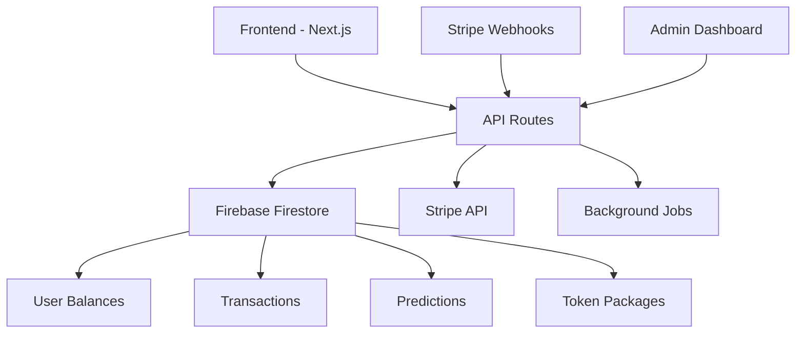

# Token Management System Design

## Overview

The Token Management System implements a Web2-based token economy for the KAI prediction platform. The system uses Firebase for data storage, Stripe for payment processing, and React/Next.js for the frontend. This design prioritizes simplicity, security, and regulatory compliance while providing a seamless user experience for token purchases, balance management, and prediction commitments.

## Architecture

### High-Level Architecture



### System Components

1. **Frontend Layer**: React components for wallet UI, purchase flows, and transaction history
2. **API Layer**: Next.js API routes handling business logic and external service integration
3. **Data Layer**: Firebase Firestore for persistent storage with real-time capabilities
4. **Payment Layer**: Stripe integration for secure payment processing
5. **Background Processing**: Queue system for async operations like payout calculations

## Components and Interfaces

### Frontend Components

#### WalletDashboard Component
```typescript
interface WalletDashboardProps {
  userId: string;
}

interface WalletState {
  availableBalance: number;
  committedBalance: number;
  totalBalance: number;
  recentTransactions: Transaction[];
  isLoading: boolean;
}
```

#### TokenPurchaseModal Component
```typescript
interface TokenPurchaseModalProps {
  isOpen: boolean;
  onClose: () => void;
  onSuccess: (tokens: number) => void;
}

interface TokenPackage {
  id: string;
  tokens: number;
  priceUSD: number;
  bonus?: number;
  popular?: boolean;
}
```

#### PredictionCommitment Component
```typescript
interface PredictionCommitmentProps {
  predictionId: string;
  maxTokens: number;
  onCommit: (tokens: number) => Promise<void>;
}
```

### API Endpoints

#### Token Purchase Flow
- `POST /api/tokens/purchase` - Initiate token purchase
- `POST /api/webhooks/stripe` - Handle Stripe payment confirmations
- `GET /api/tokens/packages` - Fetch available token packages

#### Balance Management
- `GET /api/wallet/balance` - Get user's current balance
- `GET /api/wallet/transactions` - Fetch transaction history
- `POST /api/wallet/commit` - Commit tokens to prediction

#### Admin Operations
- `GET /api/admin/tokens/stats` - Token economy statistics
- `POST /api/admin/tokens/packages` - Update token packages
- `GET /api/admin/transactions` - Transaction monitoring

## Data Models

### User Balance Model
```typescript
interface UserBalance {
  userId: string;
  availableTokens: number;
  committedTokens: number;
  totalEarned: number;
  totalSpent: number;
  lastUpdated: Timestamp;
  version: number; // For optimistic locking
}
```

### Transaction Model
```typescript
interface Transaction {
  id: string;
  userId: string;
  type: 'purchase' | 'commit' | 'win' | 'loss' | 'refund';
  amount: number;
  balanceBefore: number;
  balanceAfter: number;
  relatedId?: string; // predictionId or purchaseId
  metadata: {
    stripePaymentId?: string;
    predictionTitle?: string;
    packageId?: string;
  };
  timestamp: Timestamp;
  status: 'pending' | 'completed' | 'failed';
}
```

### Token Package Model
```typescript
interface TokenPackage {
  id: string;
  name: string;
  tokens: number;
  priceUSD: number;
  bonusTokens: number;
  stripePriceId: string;
  isActive: boolean;
  sortOrder: number;
  createdAt: Timestamp;
}
```

### Prediction Commitment Model
```typescript
interface PredictionCommitment {
  id: string;
  userId: string;
  predictionId: string;
  tokensCommitted: number;
  position: 'yes' | 'no';
  odds: number;
  potentialWinning: number;
  status: 'active' | 'won' | 'lost' | 'refunded';
  committedAt: Timestamp;
  resolvedAt?: Timestamp;
}
```

## Error Handling

### Payment Processing Errors
- **Insufficient Funds**: Clear messaging with option to try different payment method
- **Payment Declined**: Retry mechanism with exponential backoff
- **Network Errors**: Offline queue for retry when connection restored
- **Webhook Failures**: Dead letter queue for manual processing

### Balance Management Errors
- **Insufficient Tokens**: Prevent commitment with clear messaging and purchase options
- **Concurrent Modifications**: Optimistic locking with retry mechanism
- **Data Inconsistency**: Background reconciliation jobs to detect and fix discrepancies

### Security Measures
- **Rate Limiting**: Prevent rapid token purchases or commitments
- **Fraud Detection**: Monitor for suspicious patterns in purchases and predictions
- **Input Validation**: Strict validation on all token amounts and user inputs
- **Audit Logging**: Comprehensive logging for all financial operations

## Testing Strategy

### Unit Tests
- **Balance Calculations**: Test all token arithmetic operations
- **Payment Processing**: Mock Stripe integration for purchase flows
- **Commitment Logic**: Verify token locking and unlocking mechanisms
- **Validation Rules**: Test all input validation and business rules

### Integration Tests
- **End-to-End Purchase Flow**: From UI click to balance update
- **Prediction Lifecycle**: Token commitment through payout
- **Webhook Processing**: Stripe webhook handling and database updates
- **Admin Operations**: Package management and reporting features

### Load Testing
- **Concurrent Purchases**: Multiple users buying tokens simultaneously
- **High-Volume Commitments**: Stress test during popular predictions
- **Database Performance**: Query optimization for transaction history
- **Payment Processing**: Stripe API rate limits and error handling

### Security Testing
- **Payment Security**: PCI compliance validation
- **Authentication**: Verify user can only access their own tokens
- **Authorization**: Admin-only endpoints properly protected
- **Data Encryption**: Sensitive data properly encrypted at rest

## Performance Considerations

### Database Optimization
- **Indexing Strategy**: Composite indexes on userId + timestamp for transactions
- **Denormalization**: Store current balance on user document for fast reads
- **Pagination**: Implement cursor-based pagination for transaction history
- **Caching**: Redis cache for frequently accessed balance data

### Real-time Updates
- **Firebase Listeners**: Real-time balance updates across user sessions
- **Optimistic Updates**: Immediate UI feedback with server confirmation
- **Conflict Resolution**: Handle concurrent balance modifications gracefully

### Scalability
- **Background Jobs**: Async processing for payout calculations
- **Queue Management**: Bull/Agenda for reliable job processing
- **Database Sharding**: Partition strategy for high user volumes
- **CDN Integration**: Cache static token package data

## Security Architecture

### Payment Security
- **PCI Compliance**: Stripe handles all card data processing
- **Webhook Verification**: Validate Stripe webhook signatures
- **Idempotency**: Prevent duplicate payment processing
- **Encryption**: Encrypt sensitive transaction metadata

### Access Control
- **JWT Authentication**: Secure API endpoint access
- **Role-Based Permissions**: Admin vs user access levels
- **Rate Limiting**: Prevent abuse of purchase and commitment endpoints
- **Audit Trail**: Log all administrative actions

### Data Protection
- **Encryption at Rest**: Firebase encryption for stored data
- **Encryption in Transit**: HTTPS for all API communications
- **Data Retention**: Automatic cleanup of old transaction logs
- **Privacy Compliance**: GDPR-compliant data handling procedures