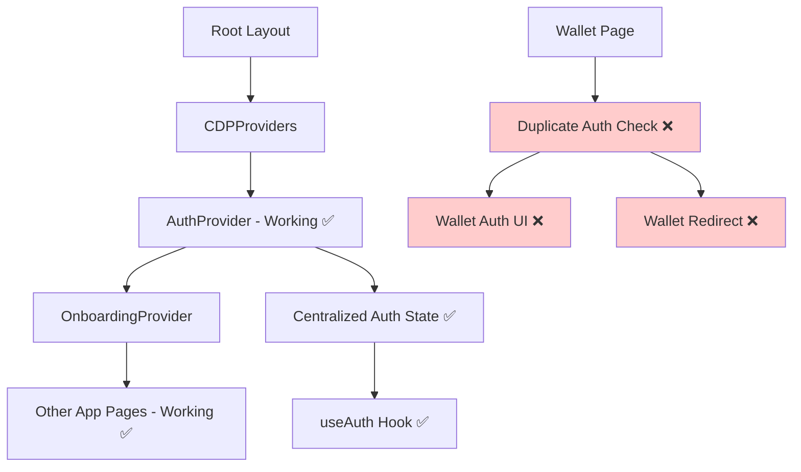
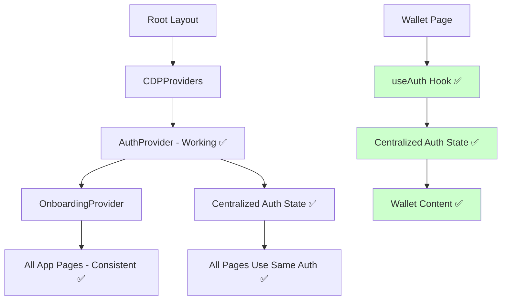
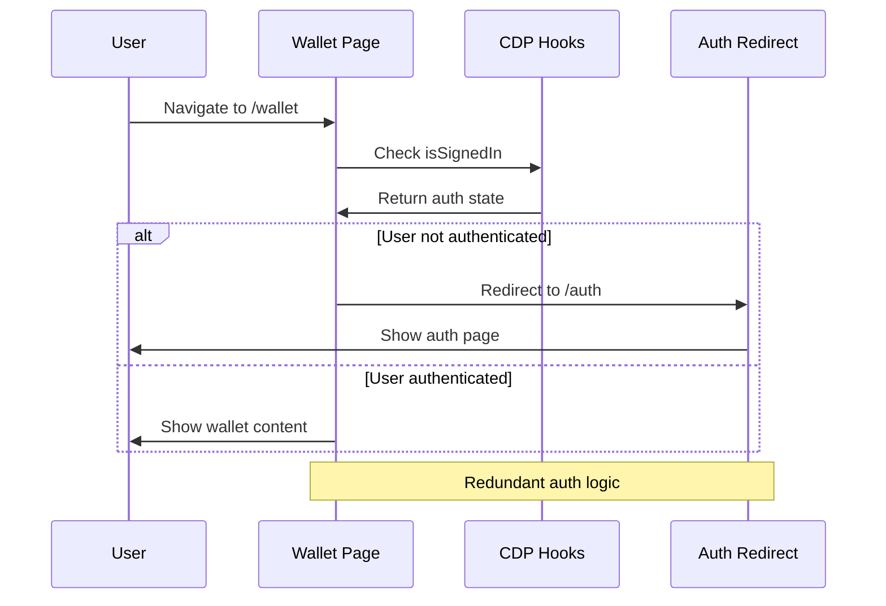
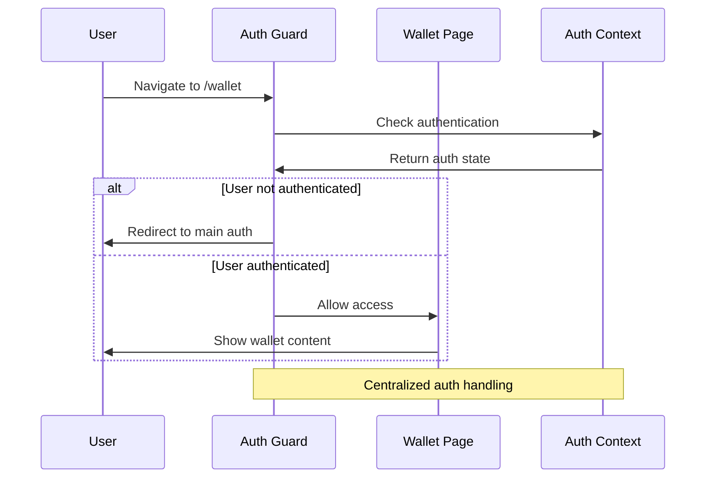

# Design Document

## Overview

The KAI platform has a working centralized authentication system that properly handles user authentication across the application. However, the wallet page contains duplicate authentication logic that creates redundant auth checks and confusing user experience. This design will remove the duplicate authentication logic from the wallet page so it uses the existing centralized authentication system like all other pages.

## Architecture

### Current Authentication Architecture (Problem)



### Target Authentication Architecture (Solution)



### Authentication Flow Comparison

#### Current Flow (Problematic)


#### Target Flow (Clean)


## Components and Interfaces

### 1. Authentication Guard Component

```typescript
// components/auth/auth-guard.tsx
interface AuthGuardProps {
  children: React.ReactNode;
  redirectTo?: string;
  fallback?: React.ReactNode;
  requireAuth?: boolean;
}

interface AuthGuardState {
  isLoading: boolean;
  isAuthenticated: boolean;
  shouldRedirect: boolean;
}

export function AuthGuard({
  children,
  redirectTo = '/auth',
  fallback = <AuthLoadingSpinner />,
  requireAuth = true
}: AuthGuardProps): React.ReactElement;
```

### 2. Cleaned Wallet Page Structure

```typescript
// app/wallet/page.tsx
interface CleanWalletPageProps {
  // No authentication props needed
}

interface WalletPageState {
  // Only wallet-specific state
  balances: TokenBalance[];
  transactions: Transaction[];
  networkInfo: NetworkInfo;
  loading: {
    balances: boolean;
    transactions: boolean;
  };
  errors: {
    balances?: string;
    transactions?: string;
  };
}

// Remove all authentication logic
export default function WalletPage(): React.ReactElement;
```

### 3. Authentication Context Integration

```typescript
// Enhanced useAuth hook usage pattern
interface WalletAuthIntegration {
  // Use centralized auth state
  user: AuthUser | null;
  isAuthenticated: boolean;
  isLoading: boolean;
  
  // No wallet-specific auth methods needed
  // All auth handled by centralized system
}
```

### 4. Route Protection Strategy

```typescript
// lib/auth/route-protection.ts
interface RouteProtectionConfig {
  protectedRoutes: string[];
  publicRoutes: string[];
  authRedirectPath: string;
  postAuthRedirectPath?: string;
}

interface RouteGuardBehavior {
  onUnauthenticated: (currentPath: string) => void;
  onAuthenticated: (user: AuthUser) => void;
  onAuthLoading: () => React.ReactElement;
}
```

## Data Models

### Authentication State Management

```typescript
// Centralized authentication state (existing)
interface AuthContextType {
  user: AuthUser | null;
  isLoading: boolean;
  isAuthenticated: boolean;
  login: (credentials: LoginCredentials) => Promise<void>;
  register: (credentials: RegisterCredentials) => Promise<void>;
  logout: () => Promise<void>;
  updateUser: (updates: Partial<AuthUser>) => Promise<void>;
  refreshUser: () => Promise<void>;
}

// Wallet page should only use this, no additional auth state
interface WalletPageAuthUsage {
  // Only consume, never manage auth state
  readonly isAuthenticated: boolean;
  readonly user: AuthUser | null;
  readonly isLoading: boolean;
}
```

### Route Configuration

```typescript
// Route protection configuration
interface RouteConfig {
  path: string;
  requiresAuth: boolean;
  redirectPath?: string;
  allowedRoles?: string[];
}

const routeConfig: RouteConfig[] = [
  {
    path: '/wallet',
    requiresAuth: true,
    redirectPath: '/auth'
  },
  {
    path: '/profile',
    requiresAuth: true,
    redirectPath: '/auth'
  },
  {
    path: '/markets/create',
    requiresAuth: true,
    redirectPath: '/auth'
  }
];
```

## Error Handling

### Authentication Error Classification

```typescript
enum AuthErrorType {
  // Remove wallet-specific errors
  NOT_AUTHENTICATED = 'not_authenticated',
  SESSION_EXPIRED = 'session_expired',
  INVALID_CREDENTIALS = 'invalid_credentials',
  
  // Keep only general auth errors
  AUTH_CONTEXT_MISSING = 'auth_context_missing',
  AUTH_PROVIDER_ERROR = 'auth_provider_error',
}

interface AuthError {
  type: AuthErrorType;
  message: string;
  redirectPath?: string;
  retryable: boolean;
}
```

### Error Recovery Strategy

```typescript
class AuthErrorRecovery {
  static handleUnauthenticated(currentPath: string): void {
    // Centralized handling for all pages
    // Store intended destination
    // Redirect to main auth flow
  }
  
  static handleAuthContextError(): void {
    // Handle auth provider failures
    // Show error boundary
    // Provide retry mechanism
  }
  
  static handleSessionExpired(): void {
    // Clear stale auth state
    // Redirect to auth with message
    // Preserve user's intended action
  }
}
```

## Implementation Strategy

### Simple Cleanup Approach

1. **Remove duplicate authentication logic from wallet page**
   - Delete the redundant `if (!isSignedIn || !address)` check
   - Remove the wallet-specific authentication UI component
   - Remove the wallet-specific redirect to `/auth`

2. **Use existing centralized authentication**
   - Let the existing AuthProvider handle authentication state
   - Use the existing useAuth hook if needed for user data
   - Rely on app-level authentication protection

3. **Ensure consistent behavior**
   - Wallet page behaves like other protected pages
   - No duplicate authentication prompts
   - Seamless user experience

## Testing Strategy

### Component Testing

```typescript
// Test AuthGuard component
describe('AuthGuard', () => {
  it('should render children when authenticated');
  it('should redirect when not authenticated');
  it('should show loading state during auth check');
  it('should handle auth errors gracefully');
});

// Test cleaned wallet page
describe('WalletPage', () => {
  it('should render wallet content when wrapped in AuthGuard');
  it('should not contain any authentication logic');
  it('should use centralized auth state only');
});
```

### Integration Testing

```typescript
// Test authentication flow
describe('Authentication Integration', () => {
  it('should redirect unauthenticated users from wallet page');
  it('should allow authenticated users to access wallet');
  it('should preserve intended destination after auth');
  it('should handle auth state changes consistently');
});
```

### User Experience Testing

```typescript
// Test user flows
describe('User Authentication Experience', () => {
  it('should provide consistent auth behavior across pages');
  it('should not show multiple auth prompts');
  it('should handle session expiry gracefully');
  it('should preserve user context during auth flows');
});
```

## Security Considerations

### Authentication Consistency

- **Single Source of Truth**: All auth state managed by centralized AuthProvider
- **No Auth Bypass**: Remove all page-specific auth logic to prevent bypass
- **Consistent Validation**: Use same auth validation across all protected routes
- **Session Management**: Centralized session handling and expiry

### Route Protection

- **Default Deny**: Protected routes require explicit authentication
- **Redirect Security**: Validate redirect destinations to prevent open redirects
- **State Preservation**: Securely preserve user intent during auth flows
- **Error Handling**: Don't expose sensitive auth errors to users

## Performance Optimizations

### Authentication Efficiency

```typescript
// Optimize auth checks
const authOptimizations = {
  // Cache auth state to avoid repeated checks
  cacheAuthState: true,
  
  // Preload auth state on app initialization
  preloadAuth: true,
  
  // Batch auth state updates
  batchUpdates: true,
  
  // Lazy load auth-dependent components
  lazyLoadProtected: true
};
```

### Loading State Management

- **Skeleton Loading**: Show content structure while auth loads
- **Progressive Enhancement**: Show public content first, then auth-dependent features
- **Error Boundaries**: Graceful degradation for auth failures
- **Caching Strategy**: Cache auth state to reduce loading times

## Migration Plan

### Step 1: Preparation
- Create AuthGuard component
- Set up route protection utilities
- Add comprehensive tests

### Step 2: Wallet Page Cleanup
- Remove wallet-specific auth logic
- Wrap wallet page with AuthGuard
- Update wallet page tests

### Step 3: Validation
- Test authentication flows
- Verify no regression in other pages
- Validate user experience

### Step 4: Standardization
- Apply pattern to other protected pages
- Update documentation
- Clean up unused auth code

## Monitoring and Validation

### Success Metrics
- **Code Reduction**: Measure lines of auth code removed
- **Consistency**: Verify all pages use same auth pattern
- **User Experience**: No authentication confusion or multiple prompts
- **Performance**: Faster page loads due to simplified auth logic

### Validation Criteria
- Wallet page contains zero authentication logic
- All protected pages use AuthGuard pattern
- Authentication behavior is consistent across the app
- No user reports of authentication confusion