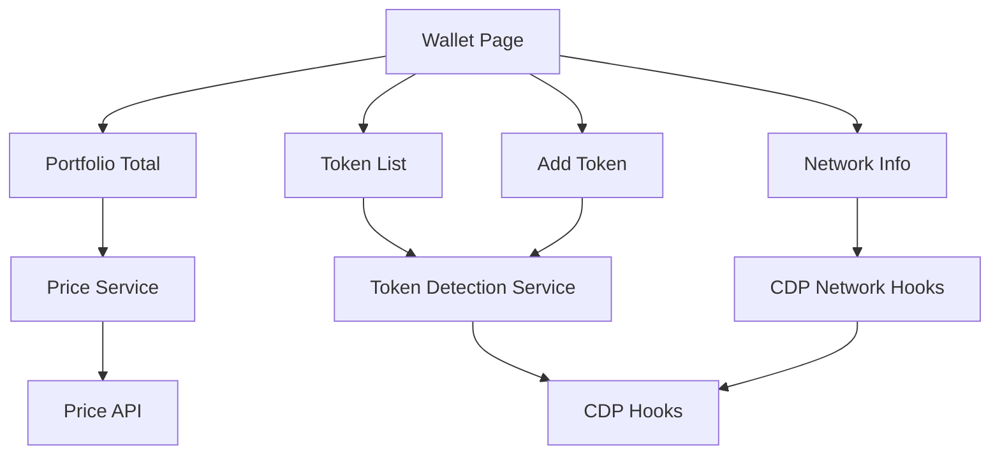
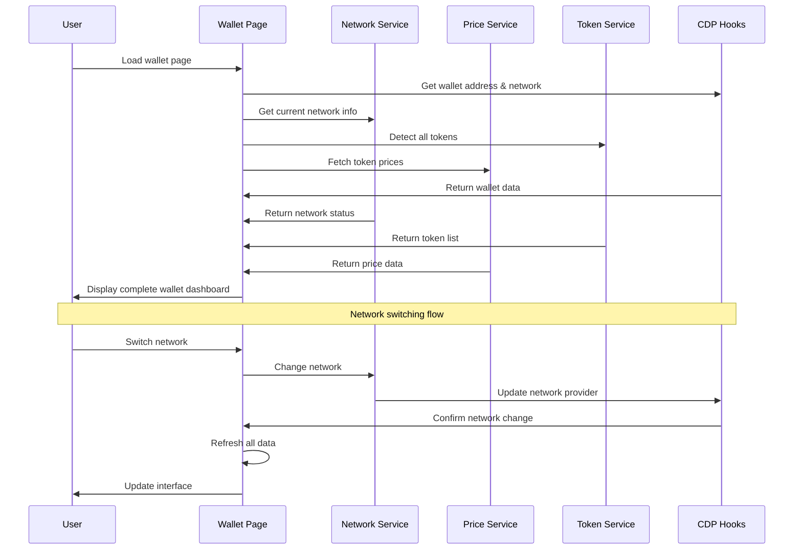
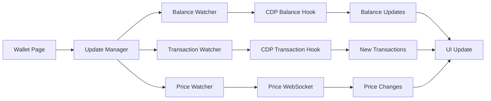

# Design Document

## Overview

The Wallet Dashboard Enhancement focuses on core missing functionality in KAI's smart wallet interface. This design adds total portfolio value calculation, real token detection, custom token support, and network awareness using Coinbase CDP hooks. The interface maintains KAI's existing design system while adding essential wallet features that work reliably.

## Architecture

### High-Level Component Architecture



### Data Flow Architecture



### Real-time Update Architecture



## Components and Interfaces

### Core Components

#### 1. Enhanced Wallet Page Structure
```typescript
// app/wallet/page.tsx
interface WalletPageProps {
  initialNetwork?: string;
}

interface WalletState {
  network: NetworkInfo;
  portfolio: PortfolioData;
  assets: TokenAsset[];
  transactions: TransactionData[];
  settings: WalletSettings;
  loading: {
    portfolio: boolean;
    assets: boolean;
    transactions: boolean;
    networkSwitch: boolean;
  };
  errors: {
    network?: string;
    portfolio?: string;
    assets?: string;
    transactions?: string;
  };
}
```

#### 2. Network Management Component
```typescript
// app/wallet/components/network-selector.tsx
interface NetworkSelectorProps {
  currentNetwork: NetworkInfo;
  availableNetworks: NetworkInfo[];
  onNetworkChange: (network: NetworkInfo) => Promise<void>;
  isLoading: boolean;
}

interface NetworkInfo {
  id: string;
  name: string;
  displayName: string;
  isTestnet: boolean;
  rpcUrl: string;
  blockExplorer: string;
  nativeCurrency: {
    name: string;
    symbol: string;
    decimals: number;
  };
  status: 'active' | 'maintenance' | 'deprecated';
}
```

#### 3. Portfolio Overview Component
```typescript
// app/wallet/components/portfolio-overview.tsx
interface PortfolioOverviewProps {
  totalValue: number;
  valueChange: {
    amount: number;
    percentage: number;
    period: '24h' | '7d' | '30d';
  };
  assets: TokenAsset[];
  isLoading: boolean;
}

interface PortfolioData {
  totalValueUSD: number;
  totalValueETH: number;
  valueChange24h: {
    usd: number;
    percentage: number;
  };
  lastUpdated: Date;
  priceSource: string;
}
```

#### 4. Enhanced Asset Management
```typescript
// app/wallet/components/asset-list.tsx
interface AssetListProps {
  assets: TokenAsset[];
  showZeroBalances: boolean;
  sortBy: 'value' | 'balance' | 'name';
  onToggleZeroBalances: (show: boolean) => void;
  onAddCustomToken: (tokenAddress: string) => Promise<void>;
}

interface TokenAsset {
  address: string;
  symbol: string;
  name: string;
  decimals: number;
  balance: string;
  balanceFormatted: string;
  valueUSD: number;
  priceUSD: number;
  priceChange24h: number;
  logoUrl?: string;
  isNative: boolean;
  isCustom: boolean;
  lastUpdated: Date;
}
```

#### 5. Advanced Transaction Manager
```typescript
// app/wallet/components/transaction-manager.tsx
interface TransactionManagerProps {
  transactions: TransactionData[];
  filters: TransactionFilters;
  onFilterChange: (filters: TransactionFilters) => void;
  onExport: (format: 'csv' | 'json', dateRange: DateRange) => void;
}

interface TransactionData {
  hash: string;
  type: 'send' | 'receive' | 'swap' | 'approve';
  status: 'pending' | 'confirmed' | 'failed';
  timestamp: Date;
  blockNumber?: number;
  confirmations: number;
  
  // Asset information
  asset: {
    symbol: string;
    address: string;
    amount: string;
    valueUSD?: number;
  };
  
  // Addresses
  from: string;
  to: string;
  
  // Gas information
  gasUsed?: string;
  gasPrice?: string;
  gasFeeUSD?: number;
  
  // Additional metadata
  method?: string;
  description?: string;
  tags: string[];
}

interface TransactionFilters {
  type?: TransactionData['type'][];
  status?: TransactionData['status'][];
  asset?: string[];
  dateRange?: {
    start: Date;
    end: Date;
  };
  amountRange?: {
    min: number;
    max: number;
  };
  searchQuery?: string;
}
```

#### 6. Wallet Settings Component
```typescript
// app/wallet/components/wallet-settings.tsx
interface WalletSettingsProps {
  settings: WalletSettings;
  onSettingsChange: (settings: Partial<WalletSettings>) => Promise<void>;
}

interface WalletSettings {
  notifications: {
    transactions: boolean;
    priceAlerts: boolean;
    security: boolean;
    email: boolean;
    push: boolean;
  };
  display: {
    currency: 'USD' | 'EUR' | 'GBP';
    showZeroBalances: boolean;
    defaultSortBy: 'value' | 'balance' | 'name';
    theme: 'light' | 'dark' | 'auto';
  };
  security: {
    recoveryEmail: string;
    backupStatus: 'complete' | 'partial' | 'none';
    lastBackup?: Date;
    twoFactorEnabled: boolean;
  };
  privacy: {
    hideBalances: boolean;
    analyticsEnabled: boolean;
    crashReporting: boolean;
  };
}
```

### Service Layer Interfaces

#### 1. Network Service
```typescript
// lib/services/network-service.ts
class NetworkService {
  static async switchNetwork(networkId: string): Promise<void>;
  static async getCurrentNetwork(): Promise<NetworkInfo>;
  static async getAvailableNetworks(): Promise<NetworkInfo[]>;
  static async validateNetwork(networkId: string): Promise<boolean>;
  static onNetworkChange(callback: (network: NetworkInfo) => void): () => void;
}
```

#### 2. Price Service
```typescript
// lib/services/price-service.ts
class PriceService {
  static async getTokenPrices(tokenAddresses: string[]): Promise<TokenPrice[]>;
  static async getPortfolioValue(assets: TokenAsset[]): Promise<PortfolioData>;
  static async getPriceHistory(tokenAddress: string, period: string): Promise<PricePoint[]>;
  static subscribeToPrice(tokenAddress: string, callback: (price: TokenPrice) => void): () => void;
}

interface TokenPrice {
  address: string;
  priceUSD: number;
  priceChange24h: number;
  marketCap?: number;
  volume24h?: number;
  lastUpdated: Date;
}
```

#### 3. Token Detection Service
```typescript
// lib/services/token-detection-service.ts
class TokenDetectionService {
  static async detectTokens(walletAddress: string): Promise<TokenAsset[]>;
  static async getTokenMetadata(tokenAddress: string): Promise<TokenMetadata>;
  static async addCustomToken(tokenAddress: string): Promise<TokenAsset>;
  static async removeCustomToken(tokenAddress: string): Promise<void>;
}

interface TokenMetadata {
  address: string;
  symbol: string;
  name: string;
  decimals: number;
  logoUrl?: string;
  website?: string;
  description?: string;
  verified: boolean;
}
```

## Data Models

### Enhanced Wallet State Management
```typescript
// lib/hooks/use-enhanced-wallet.ts
interface EnhancedWalletState {
  // Network state
  currentNetwork: NetworkInfo;
  networkLoading: boolean;
  networkError?: string;
  
  // Portfolio state
  portfolio: PortfolioData;
  portfolioLoading: boolean;
  portfolioError?: string;
  
  // Assets state
  assets: TokenAsset[];
  assetsLoading: boolean;
  assetsError?: string;
  showZeroBalances: boolean;
  
  // Transactions state
  transactions: TransactionData[];
  transactionsLoading: boolean;
  transactionsError?: string;
  transactionFilters: TransactionFilters;
  
  // Settings state
  settings: WalletSettings;
  settingsLoading: boolean;
  settingsError?: string;
  
  // Real-time updates
  lastUpdated: Date;
  updateInterval: number;
  autoRefresh: boolean;
}
```

### Local Storage Schema
```typescript
// Cached wallet data structure
interface WalletCache {
  version: string;
  walletAddress: string;
  network: string;
  
  // Cached data with timestamps
  portfolio: {
    data: PortfolioData;
    timestamp: number;
    ttl: number;
  };
  
  assets: {
    data: TokenAsset[];
    timestamp: number;
    ttl: number;
  };
  
  transactions: {
    data: TransactionData[];
    timestamp: number;
    ttl: number;
  };
  
  settings: WalletSettings;
  
  // User preferences
  preferences: {
    showZeroBalances: boolean;
    sortBy: string;
    currency: string;
    autoRefresh: boolean;
  };
}
```

## Error Handling

### Error Classification System
```typescript
enum WalletErrorType {
  // Network errors
  NETWORK_SWITCH_FAILED = 'network_switch_failed',
  NETWORK_UNAVAILABLE = 'network_unavailable',
  RPC_ERROR = 'rpc_error',
  
  // Data fetching errors
  BALANCE_FETCH_FAILED = 'balance_fetch_failed',
  PRICE_FETCH_FAILED = 'price_fetch_failed',
  TRANSACTION_FETCH_FAILED = 'transaction_fetch_failed',
  
  // User action errors
  TRANSACTION_FAILED = 'transaction_failed',
  INSUFFICIENT_BALANCE = 'insufficient_balance',
  INVALID_ADDRESS = 'invalid_address',
  
  // System errors
  CACHE_ERROR = 'cache_error',
  SETTINGS_SAVE_FAILED = 'settings_save_failed',
  TOKEN_DETECTION_FAILED = 'token_detection_failed',
}

interface WalletError {
  type: WalletErrorType;
  message: string;
  details?: any;
  retryable: boolean;
  userAction?: string;
  timestamp: Date;
}
```

### Error Recovery Strategies
```typescript
class ErrorRecoveryService {
  static async handleNetworkError(error: WalletError): Promise<void> {
    // Attempt to switch to backup RPC
    // Show network status indicator
    // Queue failed requests for retry
  }
  
  static async handleDataFetchError(error: WalletError): Promise<void> {
    // Use cached data if available
    // Implement exponential backoff retry
    // Show stale data indicators
  }
  
  static async handleTransactionError(error: WalletError): Promise<void> {
    // Parse transaction failure reason
    // Suggest corrective actions
    // Offer retry with adjusted parameters
  }
}
```

## Testing Strategy

### Component Testing
```typescript
// Test network switching functionality
describe('NetworkSelector', () => {
  it('should switch networks and update all data');
  it('should show testnet warning on testnet');
  it('should handle network switch failures gracefully');
});

// Test portfolio calculations
describe('PortfolioOverview', () => {
  it('should calculate total portfolio value correctly');
  it('should show percentage changes with correct colors');
  it('should handle missing price data gracefully');
});

// Test asset management
describe('AssetList', () => {
  it('should detect and display all tokens');
  it('should hide/show zero balances based on setting');
  it('should add custom tokens successfully');
});
```

### Integration Testing
```typescript
// Test complete wallet flow
describe('Wallet Integration', () => {
  it('should load wallet data on page mount');
  it('should update data when network changes');
  it('should sync data across components');
  it('should handle offline/online transitions');
});
```

### Performance Testing
```typescript
// Test loading performance
describe('Wallet Performance', () => {
  it('should load critical data within 2 seconds');
  it('should handle 100+ tokens without performance degradation');
  it('should update UI within 100ms of user interactions');
});
```

## Security Considerations

### Data Validation
- **Token Addresses**: Validate all token addresses are valid Ethereum addresses
- **Network IDs**: Ensure network IDs match supported networks
- **Price Data**: Validate price data from multiple sources to prevent manipulation
- **Transaction Data**: Verify transaction signatures and block confirmations

### Privacy Protection
- **Balance Hiding**: Option to hide sensitive balance information
- **Transaction Privacy**: Limit transaction history exposure
- **Analytics**: User control over data collection and analytics
- **Local Storage**: Encrypt sensitive cached data

### Rate Limiting
- **API Calls**: Implement rate limiting for external API calls
- **Network Requests**: Batch requests where possible to reduce load
- **Price Updates**: Limit price update frequency to prevent spam
- **Transaction Queries**: Cache transaction data to reduce blockchain queries

## Performance Optimizations

### Data Loading Strategy
```typescript
// Prioritized loading sequence
const loadingSequence = [
  'wallet_address',      // Immediate
  'network_info',        // Immediate  
  'native_balance',      // High priority
  'major_tokens',        // High priority
  'portfolio_value',     // Medium priority
  'all_tokens',         // Medium priority
  'transaction_history', // Low priority
  'price_history',      // Low priority
];
```

### Caching Strategy
- **Balance Data**: Cache for 30 seconds with background refresh
- **Token Metadata**: Cache for 24 hours (rarely changes)
- **Price Data**: Cache for 60 seconds with real-time updates
- **Transaction History**: Cache for 5 minutes with incremental updates
- **Settings**: Persist locally with cloud backup

### Mobile Optimization
- **Touch Targets**: Minimum 44px touch targets for all interactive elements
- **Gesture Support**: Swipe actions for transaction management
- **Responsive Design**: Optimized layouts for various screen sizes
- **Performance**: Lazy loading for non-critical components
- **Offline Support**: Essential data available offline

## Monitoring and Analytics

### Key Performance Indicators
- **Load Time**: Time to display critical wallet information
- **Error Rate**: Percentage of failed operations by type
- **User Engagement**: Feature usage and interaction patterns
- **Network Performance**: RPC response times and success rates

### User Experience Metrics
- **Task Completion Rate**: Success rate for common wallet operations
- **Time to Complete**: Average time for key user flows
- **Error Recovery**: Success rate of error recovery flows
- **User Satisfaction**: Feedback scores and support ticket volume

### Technical Metrics
- **API Response Times**: Monitor all external API performance
- **Cache Hit Rate**: Effectiveness of caching strategies
- **Memory Usage**: Client-side memory consumption
- **Network Usage**: Data transfer optimization effectiveness