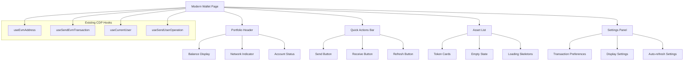
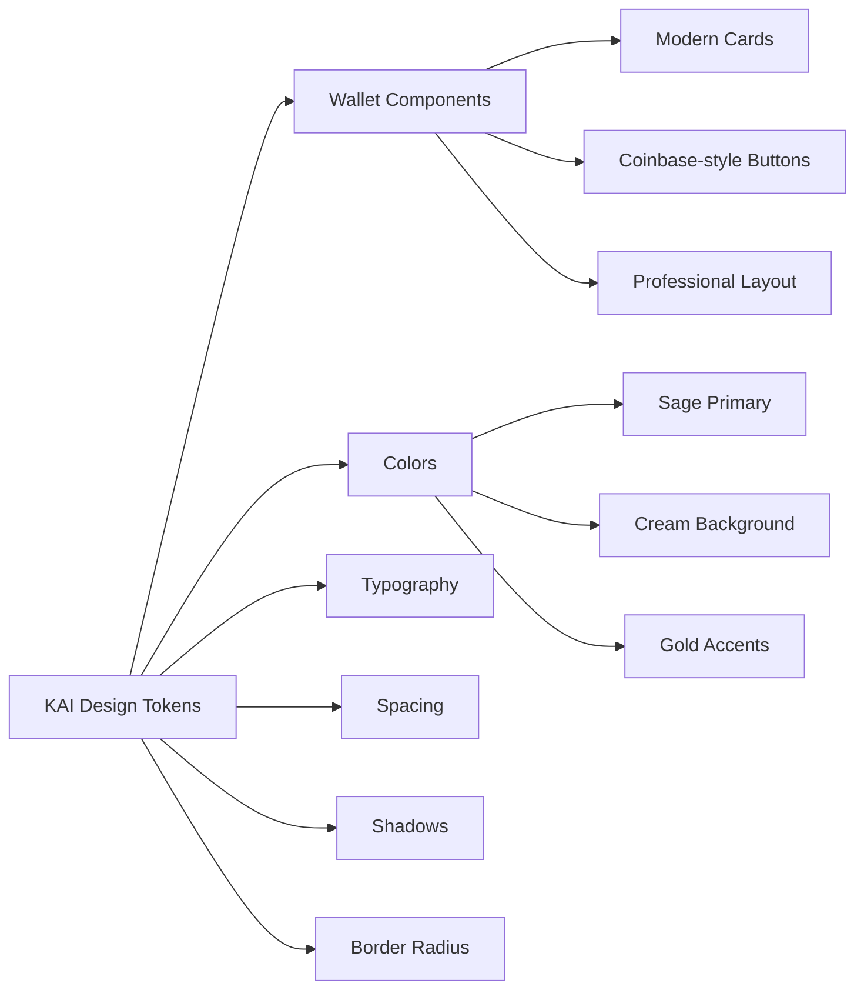
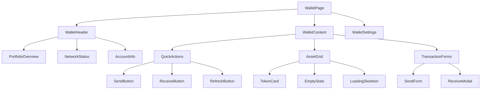

# Design Document

## Overview

The Wallet UI Modernization transforms KAI's existing functional wallet into a modern, professional interface that matches industry standards like Coinbase Wallet, MetaMask, and Zerion. The design preserves all existing CDP hook functionality while implementing Coinbase wallet-inspired design patterns using KAI's sage green and cream color palette. The focus is on visual improvements, better information architecture, and enhanced user experience without changing any underlying CDP integration.

## Architecture

### High-Level Component Architecture



### Visual Design System Integration



### Component Hierarchy



## Components and Interfaces

### Core Layout Components

#### 1. Modern Wallet Page Structure
```typescript
// app/wallet/page.tsx - Enhanced with modern design
interface ModernWalletPageProps {
  className?: string;
}

interface WalletUIState {
  // Existing CDP state (preserved)
  address: string | undefined;
  currentUser: any;
  balanceData: bigint | null;
  tokenBalances: any[];
  
  // Enhanced UI state
  viewMode: 'grid' | 'list';
  showZeroBalances: boolean;
  autoRefreshEnabled: boolean;
  refreshInterval: number;
  
  // Settings state
  defaultGasless: boolean;
  confirmationPreference: 'always' | 'large-amounts' | 'never';
  displayCurrency: 'USD' | 'ETH';
}
```

#### 2. Portfolio Header Component
```typescript
// app/wallet/components/portfolio-header.tsx
interface PortfolioHeaderProps {
  totalBalance: string;
  balanceLoading: boolean;
  address: string;
  networkStatus: NetworkStatus;
  onRefresh: () => void;
  refreshing: boolean;
}

interface NetworkStatus {
  name: string;
  connected: boolean;
  chainId: number;
  color: string;
  icon: string;
}
```

#### 3. Quick Actions Bar
```typescript
// app/wallet/components/quick-actions.tsx
interface QuickActionsProps {
  onSend: () => void;
  onReceive: () => void;
  onRefresh: () => void;
  disabled?: boolean;
  loading?: boolean;
}
```

#### 4. Modern Asset Card
```typescript
// app/wallet/components/modern-asset-card.tsx
interface ModernAssetCardProps {
  token: {
    symbol: string;
    name: string;
    balance: string;
    formattedBalance: string;
    isNative: boolean;
  };
  showValue?: boolean;
  onClick?: () => void;
  className?: string;
}
```

#### 5. Wallet Settings Panel
```typescript
// app/wallet/components/wallet-settings.tsx
interface WalletSettingsProps {
  settings: WalletSettings;
  onSettingsChange: (settings: Partial<WalletSettings>) => void;
  isOpen: boolean;
  onClose: () => void;
}

interface WalletSettings {
  defaultGasless: boolean;
  autoRefresh: boolean;
  refreshInterval: number; // in seconds
  showZeroBalances: boolean;
  confirmationPreference: 'always' | 'large-amounts' | 'never';
  displayCurrency: 'USD' | 'ETH';
  viewMode: 'grid' | 'list';
}
```

### Enhanced Form Components

#### 1. Modern Send Form
```typescript
// app/wallet/components/modern-send-form.tsx
interface ModernSendFormProps {
  isOpen: boolean;
  onClose: () => void;
  onSend: (params: SendParams) => Promise<void>;
  availableTokens: TokenBalance[];
  defaultGasless: boolean;
  loading: boolean;
}

interface SendParams {
  to: string;
  amount: string;
  asset: string;
  useGasless: boolean;
}
```

#### 2. Enhanced Receive Modal
```typescript
// app/wallet/components/enhanced-receive-modal.tsx
interface EnhancedReceiveModalProps {
  isOpen: boolean;
  onClose: () => void;
  address: string;
  onCopy: () => void;
  copied: boolean;
}
```

## Data Models

### Enhanced UI State Management
```typescript
// hooks/use-modern-wallet-state.tsx
interface ModernWalletState {
  // Existing CDP data (unchanged)
  address: string | undefined;
  currentUser: any;
  balanceData: bigint | null;
  tokenBalances: any[];
  
  // Enhanced UI state
  ui: {
    viewMode: 'grid' | 'list';
    showSettings: boolean;
    activeModal: 'send' | 'receive' | null;
    loading: {
      balance: boolean;
      tokens: boolean;
      transaction: boolean;
    };
    error: string | null;
  };
  
  // User preferences
  settings: WalletSettings;
  
  // Computed values
  computed: {
    hasTokens: boolean;
    totalValue: string;
    visibleTokens: any[];
  };
}
```

### Settings Persistence
```typescript
// lib/services/wallet-settings-service.ts
interface WalletSettingsService {
  loadSettings(): WalletSettings;
  saveSettings(settings: Partial<WalletSettings>): void;
  resetSettings(): void;
}

// Local storage schema
interface StoredWalletSettings {
  version: string;
  settings: WalletSettings;
  lastUpdated: number;
}
```

## Visual Design Specifications

### Color Palette (KAI + Coinbase Inspiration)
```typescript
// Design system colors for wallet components
const walletColors = {
  // Primary KAI colors
  primary: {
    sage: 'hsl(104 20% 45%)', // KAI sage green
    sageLight: 'hsl(104 20% 60%)',
    sageDark: 'hsl(104 20% 30%)',
  },
  
  // Background colors
  background: {
    cream: 'hsl(45 15% 97%)', // KAI cream
    white: 'hsl(0 0% 100%)',
    muted: 'hsl(45 15% 90%)',
  },
  
  // Accent colors
  accent: {
    gold: 'hsl(35 45% 55%)', // KAI warm gold
    goldLight: 'hsl(35 45% 65%)',
    goldDark: 'hsl(35 45% 45%)',
  },
  
  // Status colors
  status: {
    success: 'hsl(142 76% 36%)',
    warning: 'hsl(38 92% 50%)',
    error: 'hsl(0 84% 60%)',
    info: 'hsl(217 91% 60%)',
  },
  
  // Text colors
  text: {
    primary: 'hsl(104 20% 25%)', // Dark sage
    secondary: 'hsl(104 15% 40%)',
    muted: 'hsl(104 10% 60%)',
    inverse: 'hsl(0 0% 100%)',
  },
};
```

### Typography Scale
```typescript
// Wallet-specific typography
const walletTypography = {
  // Balance display
  balance: {
    large: 'text-4xl font-bold tracking-tight',
    medium: 'text-2xl font-semibold',
    small: 'text-lg font-medium',
  },
  
  // Token information
  token: {
    symbol: 'text-lg font-semibold',
    name: 'text-sm text-muted-foreground',
    balance: 'text-base font-medium',
    value: 'text-sm text-muted-foreground',
  },
  
  // UI elements
  ui: {
    button: 'text-sm font-medium',
    label: 'text-xs font-medium uppercase tracking-wide',
    caption: 'text-xs text-muted-foreground',
  },
};
```

### Component Styling Patterns

#### 1. Coinbase-Inspired Button Styles
```typescript
// Button variants with KAI colors
const buttonStyles = {
  primary: `
    bg-primary text-primary-foreground 
    hover:bg-primary/90 
    rounded-xl px-6 py-3 
    font-medium text-sm
    transition-all duration-200
    shadow-sm hover:shadow-md
    active:scale-[0.98]
  `,
  
  secondary: `
    bg-accent text-accent-foreground 
    hover:bg-accent/90 
    rounded-xl px-6 py-3 
    font-medium text-sm
    transition-all duration-200
    shadow-sm hover:shadow-md
    active:scale-[0.98]
  `,
  
  outline: `
    border-2 border-primary text-primary 
    hover:bg-primary hover:text-primary-foreground 
    rounded-xl px-6 py-3 
    font-medium text-sm
    transition-all duration-200
    active:scale-[0.98]
  `,
  
  ghost: `
    text-primary hover:bg-primary/10 
    rounded-xl px-6 py-3 
    font-medium text-sm
    transition-all duration-200
    active:scale-[0.98]
  `,
};
```

#### 2. Modern Card Styles
```typescript
// Card variants for wallet components
const cardStyles = {
  default: `
    bg-card text-card-foreground 
    rounded-2xl border border-border 
    shadow-sm hover:shadow-md 
    transition-all duration-200
    p-6
  `,
  
  elevated: `
    bg-card text-card-foreground 
    rounded-2xl border border-border 
    shadow-lg hover:shadow-xl 
    transition-all duration-200
    p-6
  `,
  
  interactive: `
    bg-card text-card-foreground 
    rounded-2xl border border-border 
    shadow-sm hover:shadow-md 
    transition-all duration-200
    p-6 cursor-pointer
    hover:border-primary/50
    active:scale-[0.99]
  `,
  
  gradient: `
    bg-gradient-to-br from-background to-muted 
    text-foreground 
    rounded-2xl border border-border 
    shadow-sm hover:shadow-md 
    transition-all duration-200
    p-6
  `,
};
```

#### 3. Token Card Design
```typescript
// Token card specific styling
const tokenCardStyles = {
  container: `
    ${cardStyles.interactive}
    flex items-center justify-between
    min-h-[80px]
  `,
  
  tokenInfo: `
    flex items-center gap-4
    flex-1
  `,
  
  tokenIcon: `
    w-12 h-12 rounded-full 
    bg-gradient-to-br from-primary/20 to-accent/20
    flex items-center justify-center
    text-primary font-semibold text-lg
  `,
  
  tokenDetails: `
    flex flex-col gap-1
  `,
  
  balanceInfo: `
    flex flex-col items-end gap-1
    text-right
  `,
};
```

### Layout Specifications

#### 1. Mobile-First Responsive Grid
```typescript
// Responsive layout system
const layoutSpecs = {
  container: `
    max-w-4xl mx-auto px-4 py-6
    sm:px-6 lg:px-8
  `,
  
  grid: {
    mobile: 'grid grid-cols-1 gap-4',
    tablet: 'sm:grid-cols-2 sm:gap-6',
    desktop: 'lg:grid-cols-3 lg:gap-8',
  },
  
  spacing: {
    section: 'space-y-6',
    component: 'space-y-4',
    element: 'space-y-2',
  },
};
```

#### 2. Header Layout
```typescript
// Portfolio header layout
const headerLayout = {
  container: `
    ${cardStyles.gradient}
    mb-6
  `,
  
  content: `
    flex flex-col sm:flex-row 
    sm:items-center sm:justify-between 
    gap-4
  `,
  
  balance: `
    flex flex-col gap-2
  `,
  
  actions: `
    flex items-center gap-3
  `,
};
```

## Error Handling

### Enhanced Error States
```typescript
// Error handling with modern UI
interface WalletError {
  type: 'network' | 'transaction' | 'balance' | 'settings';
  message: string;
  action?: {
    label: string;
    handler: () => void;
  };
  dismissible: boolean;
}

// Error display component
interface ErrorBannerProps {
  error: WalletError;
  onDismiss?: () => void;
  onAction?: () => void;
}
```

### Loading States
```typescript
// Modern loading states
const loadingStates = {
  skeleton: {
    balance: 'h-8 w-32 bg-muted animate-pulse rounded-lg',
    tokenCard: 'h-20 bg-muted animate-pulse rounded-xl',
    button: 'h-10 w-24 bg-muted animate-pulse rounded-lg',
  },
  
  spinner: {
    small: 'w-4 h-4 animate-spin',
    medium: 'w-6 h-6 animate-spin',
    large: 'w-8 h-8 animate-spin',
  },
};
```

## Testing Strategy

### Visual Regression Testing
```typescript
// Component visual tests
describe('Wallet UI Components', () => {
  it('should render portfolio header with correct KAI styling');
  it('should display token cards with proper spacing and colors');
  it('should show loading states with skeleton screens');
  it('should handle error states with appropriate styling');
});
```

### Responsive Design Testing
```typescript
// Responsive behavior tests
describe('Wallet Responsive Design', () => {
  it('should adapt layout for mobile screens');
  it('should maintain touch targets of 44px minimum');
  it('should stack components appropriately on small screens');
  it('should use grid layout effectively on larger screens');
});
```

### Accessibility Testing
```typescript
// Accessibility compliance tests
describe('Wallet Accessibility', () => {
  it('should maintain proper color contrast ratios');
  it('should provide keyboard navigation for all interactive elements');
  it('should include proper ARIA labels and descriptions');
  it('should support screen readers with semantic markup');
});
```

## Performance Optimizations

### Component Optimization
```typescript
// Performance considerations
const optimizations = {
  // Memoize expensive calculations
  memoizedComponents: [
    'TokenCard',
    'PortfolioHeader', 
    'QuickActions',
  ],
  
  // Lazy load heavy components
  lazyComponents: [
    'WalletSettings',
    'TransactionHistory',
    'AdvancedFeatures',
  ],
  
  // Virtualize long lists
  virtualizedLists: [
    'TokenList',
    'TransactionList',
  ],
};
```

### Animation Performance
```typescript
// Optimized animations
const animations = {
  // Use transform and opacity for smooth animations
  cardHover: 'transform: translateY(-2px); transition: transform 200ms ease',
  buttonPress: 'transform: scale(0.98); transition: transform 100ms ease',
  
  // Reduce motion for accessibility
  reducedMotion: '@media (prefers-reduced-motion: reduce) { * { animation: none !important; transition: none !important; } }',
};
```

## Implementation Phases

### Phase 1: Core Layout Modernization
- Implement modern wallet page structure with KAI design tokens
- Create portfolio header with balance display and network status
- Add quick actions bar with Coinbase-inspired button styling
- Preserve all existing CDP hook functionality

### Phase 2: Asset Display Enhancement
- Redesign token cards with modern styling and proper spacing
- Implement responsive grid layout for asset display
- Add loading skeletons and empty states
- Maintain existing token balance fetching logic

### Phase 3: Form and Modal Improvements
- Modernize send transaction form with better UX
- Enhance receive modal with improved address display
- Add proper form validation and error handling
- Keep existing transaction submission logic intact

### Phase 4: Settings and Preferences
- Implement wallet settings panel with user preferences
- Add gasless transaction default toggle
- Create auto-refresh and display preferences
- Integrate settings with existing CDP functionality

### Phase 5: Polish and Optimization
- Add micro-animations and smooth transitions
- Implement proper loading and error states
- Optimize performance and accessibility
- Comprehensive testing and refinement

## Monitoring and Analytics

### UI Performance Metrics
- **Component Render Time**: Track rendering performance of wallet components
- **Animation Smoothness**: Monitor frame rates during transitions
- **Layout Shift**: Measure cumulative layout shift for stability
- **Touch Response**: Track touch interaction responsiveness on mobile

### User Experience Metrics
- **Task Completion Rate**: Success rate for common wallet operations
- **Error Recovery**: How users handle and recover from errors
- **Feature Discovery**: Usage of new UI features and settings
- **Accessibility Compliance**: Screen reader and keyboard navigation success

### Design System Adoption
- **Color Consistency**: Verify proper use of KAI color tokens
- **Component Reuse**: Track usage of standardized components
- **Responsive Behavior**: Monitor layout adaptation across devices
- **Brand Alignment**: Ensure visual consistency with KAI design system