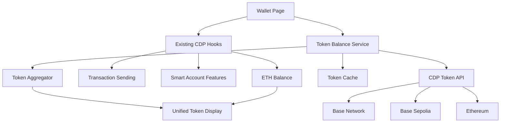
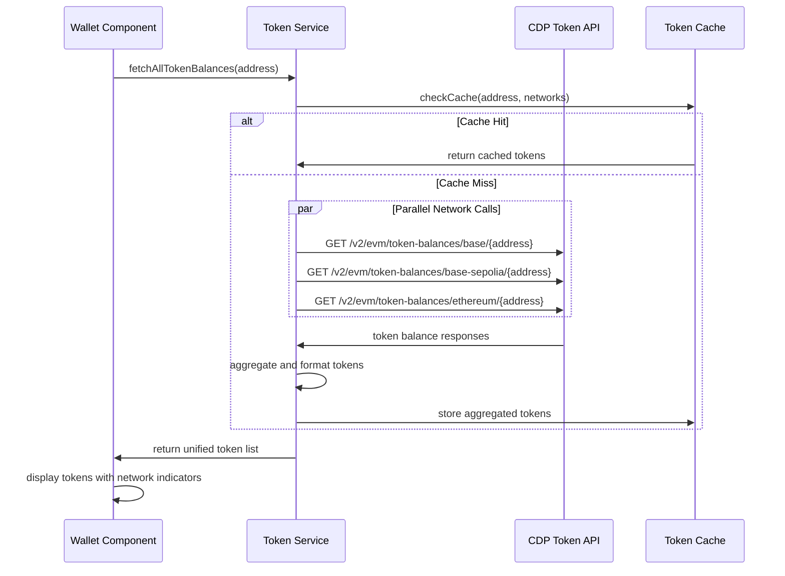
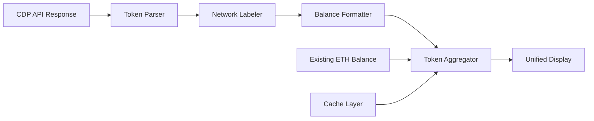

# Design Document

## Overview

The Wallet Wagmi Token Enhancement adds comprehensive token discovery capabilities to KAI's existing CDP wallet by integrating CDP's EVM Token Balance REST API. This design maintains all existing CDP hook functionality while adding automatic token discovery across Base, Base Sepolia, and Ethereum networks. The enhancement provides users with a complete view of their token portfolio without requiring manual token addition or network switching.

## Architecture

### High-Level Architecture



### API Integration Flow



### Token Data Flow



## Components and Interfaces

### Core Service Layer

#### 1. Token Balance Service
```typescript
// lib/services/cdp-token-balance-service.ts
interface TokenBalanceService {
  fetchAllTokenBalances(address: string): Promise<AggregatedTokenBalance[]>;
  fetchNetworkTokens(network: SupportedNetwork, address: string): Promise<NetworkTokenBalance[]>;
  refreshTokenBalances(address: string): Promise<AggregatedTokenBalance[]>;
}

interface AggregatedTokenBalance {
  symbol: string;
  name: string;
  contractAddress: string;
  network: SupportedNetwork;
  balance: string;
  decimals: number;
  formattedBalance: string;
  isNative: boolean;
}

type SupportedNetwork = 'base' | 'base-sepolia' | 'ethereum';
```

#### 2. CDP API Client
```typescript
// lib/services/cdp-api-client.ts
interface CDPApiClient {
  getTokenBalances(network: string, address: string, pageToken?: string): Promise<CDPTokenBalanceResponse>;
  authenticate(): Promise<string>; // Returns JWT token
}

interface CDPTokenBalanceResponse {
  balances: CDPTokenBalance[];
  nextPageToken?: string;
}

interface CDPTokenBalance {
  amount: {
    amount: string;
    decimals: number;
  };
  token: {
    network: string;
    symbol: string;
    name: string;
    contractAddress: string;
  };
}
```

#### 3. Token Cache Manager
```typescript
// lib/services/token-cache-service.ts
interface TokenCacheService {
  getCachedTokens(address: string, network: string): AggregatedTokenBalance[] | null;
  setCachedTokens(address: string, network: string, tokens: AggregatedTokenBalance[]): void;
  clearCache(address?: string): void;
  isCacheValid(address: string, network: string): boolean;
}

interface CacheEntry {
  tokens: AggregatedTokenBalance[];
  timestamp: number;
  expiresAt: number;
}
```

### React Hook Integration

#### 1. Enhanced Token Balance Hook
```typescript
// hooks/use-enhanced-token-balance.tsx
interface UseEnhancedTokenBalanceReturn {
  tokens: AggregatedTokenBalance[];
  loading: boolean;
  error: string | null;
  refreshTokens: () => Promise<void>;
  lastUpdated: Date | null;
}

function useEnhancedTokenBalance(address?: string): UseEnhancedTokenBalanceReturn;
```

#### 2. Network Status Hook
```typescript
// hooks/use-network-token-status.tsx
interface UseNetworkTokenStatusReturn {
  networkStatus: Record<SupportedNetwork, NetworkStatus>;
  overallLoading: boolean;
  hasErrors: boolean;
}

interface NetworkStatus {
  loading: boolean;
  error: string | null;
  tokenCount: number;
  lastFetched: Date | null;
}
```

### UI Component Updates

#### 1. Enhanced Token List Component
```typescript
// app/wallet/components/enhanced-token-list.tsx
interface EnhancedTokenListProps {
  tokens: AggregatedTokenBalance[];
  loading: boolean;
  error?: string | null;
  onRefresh: () => void;
  onTokenSelect?: (token: AggregatedTokenBalance) => void;
}
```

#### 2. Network Indicator Component
```typescript
// app/wallet/components/network-indicator.tsx
interface NetworkIndicatorProps {
  network: SupportedNetwork;
  size?: 'sm' | 'md' | 'lg';
  showLabel?: boolean;
}
```

#### 3. Token Balance Card Component
```typescript
// app/wallet/components/token-balance-card.tsx
interface TokenBalanceCardProps {
  token: AggregatedTokenBalance;
  onClick?: () => void;
  showNetworkIndicator?: boolean;
}
```

## Data Models

### Token Balance Data Structure

#### API Response Mapping
```typescript
// Transform CDP API response to internal format
function mapCDPTokenToAggregated(
  cdpToken: CDPTokenBalance, 
  network: SupportedNetwork
): AggregatedTokenBalance {
  return {
    symbol: cdpToken.token.symbol,
    name: cdpToken.token.name,
    contractAddress: cdpToken.token.contractAddress,
    network: network,
    balance: cdpToken.amount.amount,
    decimals: cdpToken.amount.decimals,
    formattedBalance: formatTokenBalance(cdpToken.amount.amount, cdpToken.amount.decimals),
    isNative: cdpToken.token.contractAddress === NATIVE_TOKEN_ADDRESS
  };
}
```

#### Network Configuration
```typescript
// lib/config/network-config.ts
interface NetworkConfig {
  id: SupportedNetwork;
  name: string;
  displayName: string;
  color: string;
  icon: string;
  explorerUrl: string;
}

const NETWORK_CONFIGS: Record<SupportedNetwork, NetworkConfig> = {
  'base': {
    id: 'base',
    name: 'base',
    displayName: 'Base',
    color: '#0052FF',
    icon: '🔵',
    explorerUrl: 'https://basescan.org'
  },
  'base-sepolia': {
    id: 'base-sepolia',
    name: 'base-sepolia', 
    displayName: 'Base Sepolia',
    color: '#FF6B35',
    icon: '🟠',
    explorerUrl: 'https://sepolia.basescan.org'
  },
  'ethereum': {
    id: 'ethereum',
    name: 'ethereum',
    displayName: 'Ethereum',
    color: '#627EEA',
    icon: '⚡',
    explorerUrl: 'https://etherscan.io'
  }
};
```

### Cache Data Structure
```typescript
interface TokenCacheData {
  [address: string]: {
    [network: string]: CacheEntry;
  };
}

interface CacheEntry {
  tokens: AggregatedTokenBalance[];
  timestamp: number;
  expiresAt: number;
}
```

## Error Handling

### API Error Types
```typescript
enum CDPApiErrorType {
  AUTHENTICATION_FAILED = 'authentication_failed',
  RATE_LIMIT_EXCEEDED = 'rate_limit_exceeded',
  NETWORK_ERROR = 'network_error',
  INVALID_ADDRESS = 'invalid_address',
  SERVICE_UNAVAILABLE = 'service_unavailable',
  TIMEOUT = 'timeout'
}

interface CDPApiError {
  type: CDPApiErrorType;
  message: string;
  network?: SupportedNetwork;
  retryable: boolean;
  retryAfter?: number;
}
```

### Error Recovery Strategies
```typescript
class TokenBalanceErrorHandler {
  static async handleApiError(error: CDPApiError, context: ErrorContext): Promise<ErrorRecoveryAction> {
    switch (error.type) {
      case CDPApiErrorType.RATE_LIMIT_EXCEEDED:
        return { action: 'retry', delay: error.retryAfter || 60000 };
      
      case CDPApiErrorType.AUTHENTICATION_FAILED:
        return { action: 'fallback', message: 'Using cached data' };
      
      case CDPApiErrorType.NETWORK_ERROR:
        return { action: 'retry', delay: 5000, maxRetries: 3 };
      
      case CDPApiErrorType.SERVICE_UNAVAILABLE:
        return { action: 'fallback', message: 'Service temporarily unavailable' };
      
      default:
        return { action: 'fallback', message: 'Unable to fetch token data' };
    }
  }
}
```

### Graceful Degradation
```typescript
interface FallbackStrategy {
  useCachedData: boolean;
  useExistingTokens: boolean;
  showErrorMessage: boolean;
  allowRetry: boolean;
}

const FALLBACK_STRATEGIES: Record<CDPApiErrorType, FallbackStrategy> = {
  [CDPApiErrorType.AUTHENTICATION_FAILED]: {
    useCachedData: true,
    useExistingTokens: true,
    showErrorMessage: false,
    allowRetry: true
  },
  [CDPApiErrorType.SERVICE_UNAVAILABLE]: {
    useCachedData: true,
    useExistingTokens: true,
    showErrorMessage: true,
    allowRetry: true
  }
  // ... other strategies
};
```

## Testing Strategy

### Unit Testing
- **Token Balance Service**: Test API integration, error handling, and data transformation
- **Cache Service**: Test cache hit/miss scenarios, expiration, and cleanup
- **API Client**: Test authentication, request formatting, and response parsing
- **Token Aggregation**: Test cross-network token combining and deduplication

### Integration Testing
- **End-to-End Token Flow**: Test complete flow from API call to UI display
- **Error Scenarios**: Test various API failure modes and recovery
- **Cache Behavior**: Test cache performance and invalidation
- **Network Switching**: Test parallel API calls and aggregation

### Performance Testing
- **API Response Time**: Measure and optimize token balance fetching
- **Cache Efficiency**: Test cache hit rates and memory usage
- **Parallel Network Calls**: Test concurrent API performance
- **Large Token Lists**: Test performance with wallets containing many tokens

### User Acceptance Testing
- **Token Discovery**: Verify all user tokens are discovered and displayed
- **Network Indicators**: Confirm users can identify which network tokens are on
- **Error Handling**: Test user experience during API failures
- **Performance**: Verify acceptable loading times for token data

## Security Considerations

### API Security
- **JWT Authentication**: Secure token generation and validation for CDP API
- **Rate Limiting**: Implement client-side rate limiting to prevent abuse
- **Input Validation**: Validate wallet addresses before API calls
- **Error Information**: Avoid exposing sensitive error details to users

### Data Security
- **Cache Security**: Ensure cached token data doesn't persist sensitive information
- **Network Isolation**: Separate token data by network to prevent cross-contamination
- **Address Validation**: Validate wallet addresses are properly formatted
- **API Key Protection**: Secure storage and usage of CDP API credentials

## Performance Optimizations

### API Optimization
- **Parallel Requests**: Make concurrent API calls to all networks
- **Request Deduplication**: Avoid duplicate API calls for same data
- **Pagination Handling**: Efficiently handle paginated responses
- **Connection Pooling**: Reuse HTTP connections for API calls

### Caching Strategy
- **Multi-Level Caching**: Cache at service and component levels
- **Smart Invalidation**: Invalidate cache based on user actions
- **Background Refresh**: Refresh cache in background for better UX
- **Memory Management**: Implement cache size limits and cleanup

### UI Performance
- **Lazy Loading**: Load token data progressively
- **Virtual Scrolling**: Handle large token lists efficiently
- **Optimistic Updates**: Show immediate feedback for user actions
- **Loading States**: Provide clear loading indicators

## Implementation Phases

### Phase 1: Core API Integration
- Implement CDP API client with authentication
- Create token balance service with basic functionality
- Add error handling and retry logic
- Test API integration with single network

### Phase 2: Multi-Network Support
- Extend service to support all three networks
- Implement parallel API calls and aggregation
- Add network indicators to UI components
- Test cross-network token discovery

### Phase 3: Caching and Performance
- Implement token cache service
- Add cache invalidation and refresh logic
- Optimize API call patterns and deduplication
- Performance testing and optimization

### Phase 4: UI Integration
- Update wallet page to use enhanced token service
- Integrate with existing send token functionality
- Add network indicators and improved token display
- Comprehensive testing and bug fixes

### Phase 5: Error Handling and Polish
- Implement comprehensive error handling
- Add graceful fallback to existing functionality
- User acceptance testing and refinements
- Documentation and deployment

## Monitoring and Analytics

### Key Metrics
- **API Success Rate**: Track successful token balance API calls per network
- **Cache Hit Rate**: Monitor cache effectiveness and performance
- **Token Discovery Rate**: Track how many tokens are discovered vs manual
- **Error Rates**: Monitor API failures and recovery success

### Performance Monitoring
- **API Response Times**: Track token balance API performance
- **Cache Performance**: Monitor cache hit rates and memory usage
- **UI Loading Times**: Track time to display token data
- **Network-Specific Metrics**: Monitor performance per network

### User Analytics
- **Token Usage Patterns**: Track which networks users have tokens on
- **Error Recovery**: Monitor how users interact with error states
- **Feature Adoption**: Track usage of enhanced token features
- **Performance Impact**: Monitor impact on overall wallet performance