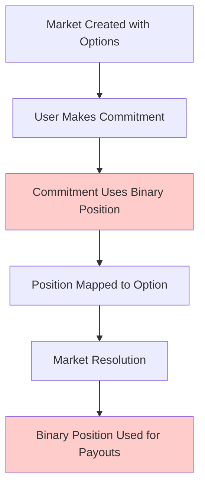

# Current System Analysis and Migration Plan

## Executive Summary

After comprehensive analysis of the KAI prediction platform's current commitment tracking system, I have identified the core structure, dependencies, and migration requirements for transforming from a binary yes/no system to unlimited multi-option support while maintaining complete backward compatibility.

## Current System Structure

### 1. PredictionCommitment Interface (lib/types/token.ts)

**Current Structure:**
```typescript
export interface PredictionCommitment {
  id: string;
  userId: string;
  predictionId: string;           // ❌ Links to Market.id
  tokensCommitted: number;
  position: 'yes' | 'no';         // ❌ BINARY LIMITATION
  odds: number;
  potentialWinning: number;
  status: 'active' | 'won' | 'lost' | 'refunded';
  committedAt: Timestamp;
  resolvedAt?: Timestamp;
  
  // User display information (for admin views)
  userEmail?: string;
  userDisplayName?: string;
  
  // Comprehensive metadata tracking
  metadata: {
    marketStatus: 'active' | 'closed' | 'resolved' | 'cancelled';
    marketTitle: string;
    marketEndsAt: Timestamp;
    
    // ❌ BINARY ODDS SNAPSHOT
    oddsSnapshot: {
      yesOdds: number;
      noOdds: number;
      totalYesTokens: number;
      totalNoTokens: number;
      totalParticipants: number;
    };
    
    userBalanceAtCommitment: number;
    commitmentSource: 'web' | 'mobile' | 'api';
    ipAddress?: string;
    userAgent?: string;
  };
}
```

**Critical Issues:**
1. **Binary Position Limitation**: `position: 'yes' | 'no'` restricts markets to 2 options only
2. **No Option ID Linking**: Commitments don't link to specific `MarketOption.id` values
3. **Binary Metadata**: `oddsSnapshot` only supports yes/no odds tracking

### 2. Market Interface (lib/types/database.ts)

**Current Structure:**
```typescript
export interface Market {
  id: string
  title: string
  description: string
  category: MarketCategory
  status: MarketStatus
  createdBy: string
  createdAt: Timestamp
  endsAt: Timestamp
  resolvedAt?: Timestamp
  
  // ✅ FLEXIBLE OPTIONS ARRAY (supports unlimited options)
  options: MarketOption[]
  
  // Stats
  totalParticipants: number
  totalTokensStaked: number
  
  // Resolution and admin fields
  pendingResolution?: boolean
  resolution?: MarketResolution
  creatorFeePercentage?: number
  featured: boolean
  trending: boolean
  adminNotes?: string
}

export interface MarketOption {
  id: string                    // ✅ Unique identifier
  text: string                  // ✅ Option display text
  imageUrl?: string
  totalTokens: number           // ✅ Calculated from commitments
  participantCount: number      // ✅ Unique users committed to this option
  odds?: number                 // ✅ Calculated odds
  isCorrect?: boolean           // ✅ Set when market resolves
}
```

**Analysis:**
- ✅ Market structure ALREADY supports unlimited options
- ✅ MarketOption has proper unique IDs
- ✅ Option-level statistics are tracked
- ❌ Commitments don't properly link to option IDs

### 3. AdminCommitmentService Dependencies

**Critical Methods Used by Dashboards:**

1. **getMarketCommitments()** - Used by:
   - Resolution dashboard (`/admin/resolution`)
   - Markets page (`/admin/markets`)
   - Market detail views

2. **getCommitmentsWithUsers()** - Used by:
   - Admin analytics dashboards
   - User management interfaces
   - Commitment reporting

3. **Query Patterns:**
   ```typescript
   // Current binary position filtering
   where('position', '==', 'yes')
   where('position', '==', 'no')
   
   // Market linking
   where('predictionId', '==', marketId)
   
   // Status filtering
   where('status', '==', 'active')
   ```

**Dashboard Dependencies:**
- `/admin/dashboard` - Total commitments, active users, token metrics
- `/admin/tokens` - Token circulation, user engagement analytics  
- `/admin/resolution` - Market statistics, participant counts
- `/admin/markets` - Market statistics with real commitment data
- Market detail pages - Individual market analytics
- User profile pages - User commitment history

### 4. Services Dependent on Binary Position System

**Services Using `position: 'yes' | 'no'`:**

1. **ResolutionService** (`lib/services/resolution-service.ts`)
   ```typescript
   // Maps binary positions to option IDs
   where('position', '==', optionId === 'yes' ? 'yes' : 'no')
   
   let winningPosition: 'yes' | 'no' | null = null
   if (winningOptionId === 'yes') {
     winningPosition = 'yes'
   }
   ```

2. **PayoutPreviewService** (`lib/services/payout-preview-service.ts`)
   ```typescript
   let winningPosition: 'yes' | 'no' | null = null
   winningPosition = winningOptionId === market.options[0]?.id ? 'yes' : 'no'
   ```

3. **UserProfileDataService** (`lib/services/user-profile-data-service.ts`)
   ```typescript
   optionId: commitment.position, // Using position as optionId
   optionName: commitment.position === 'yes' ? 'Yes' : 'No',
   ```

4. **MarketAnalyticsService** (`lib/services/market-analytics-service.ts`)
   ```typescript
   position: 'yes' | 'no'
   calculatePositionDistribution(commitments: PredictionCommitment[])
   ```

5. **TokenUtils** (`lib/utils/token-utils.ts`)
   ```typescript
   calculateOdds(totalYesTokens: number, totalNoTokens: number, position: 'yes' | 'no')
   isValidPosition(position: string): position is 'yes' | 'no'
   ```

### 5. UI Components Using Binary System

**PredictionCommitment Component** (`app/components/prediction-commitment.tsx`):
```typescript
interface PredictionCommitmentProps {
  position: 'yes' | 'no'        // ❌ Binary UI limitation
  optionId: string              // ✅ Already receives option ID
  // ...
}
```

**Market Detail View** (`app/markets/[id]/market-detail-view.tsx`):
```typescript
const [commitmentData, setCommitmentData] = useState<{
  position: 'yes' | 'no'        // ❌ UI compatibility layer
  optionId: string              // ✅ Stores actual option ID
  optionName: string
}>()

// Maps first option to 'yes', others to 'no'
position: isFirstOption ? 'yes' : 'no',
```

### 6. Current Market Creation Process

**Market Creation Form** (`app/markets/create/market-creation-form.tsx`):
```typescript
const [options, setOptions] = useState([
  { id: "1", name: "", color: "bg-kai-400" },      // ✅ Supports unlimited options
  { id: "2", name: "", color: "bg-primary-400" }   // ✅ Default 2 options
])

// ✅ Can add up to 5 options
const addOption = () => {
  if (options.length < 5) {
    setOptions([...options, { 
      id: String(options.length + 1), 
      name: "", 
      color: nextColor 
    }])
  }
}
```

**Analysis:**
- ✅ Market creation ALREADY supports unlimited options (up to 5)
- ✅ Options get unique IDs during creation
- ❌ Commitment system doesn't properly use these option IDs

## Current Data Flow Analysis

### 1. Market Creation → Commitment → Resolution Flow



**Problems:**
- Step C: Binary position loses option specificity
- Step F: Resolution must reverse-engineer option from position

### 2. Current Commitment Creation Process

```typescript
// User selects option in UI
const selectedOption = market.options[1] // "Option B"

// UI maps to binary position for compatibility
const position = isFirstOption ? 'yes' : 'no' // ❌ LOSES SPECIFICITY

// Commitment created with binary position
const commitment = {
  optionId: selectedOption.id,     // ✅ Correct option ID stored
  position: 'no',                  // ❌ Binary mapping (second option = 'no')
  predictionId: marketId
}
```

### 3. Current Resolution Process

```typescript
// Resolution service receives winning option ID
const winningOptionId = "option_2"

// Must map back to binary position
const winningPosition = winningOptionId === market.options[0]?.id ? 'yes' : 'no'

// Query commitments by binary position
const winningCommitments = query(
  collection(db, 'prediction_commitments'),
  where('predictionId', '==', marketId),
  where('position', '==', winningPosition)  // ❌ INDIRECT MAPPING
)
```

## Migration Requirements Analysis

### 1. Backward Compatibility Requirements

**Critical Constraints:**
1. All existing admin dashboards must continue working without modification
2. Existing binary commitments must be preserved with original IDs and timestamps
3. Dashboard statistics must match pre-migration values exactly
4. AdminCommitmentService queries must return data in expected format
5. Rollback to original system must be possible if needed

### 2. Data Migration Scope

**Existing Data Analysis:**
```sql
-- Estimated data to migrate
SELECT 
  COUNT(*) as total_commitments,
  COUNT(DISTINCT predictionId) as affected_markets,
  COUNT(DISTINCT userId) as affected_users
FROM prediction_commitments 
WHERE position IN ('yes', 'no')
```

**Migration Mapping Strategy:**
```typescript
// Binary position to option ID mapping
const migrationMapping = {
  'yes': market.options[0]?.id,  // First option = "yes"
  'no': market.options[1]?.id    // Second option = "no"
}
```

### 3. Service Layer Compatibility Requirements

**AdminCommitmentService Compatibility Layer:**
```typescript
class AdminCommitmentService {
  static async getMarketCommitments(marketId: string, options: ExistingOptions) {
    // Internal: Handle both binary and option-based commitments
    const commitments = await this.fetchCommitments(marketId, options)
    
    // Transform for backward compatibility
    const compatibleCommitments = commitments.map(commitment => ({
      ...commitment,
      // Ensure position field exists for backward compatibility
      position: this.derivePosition(commitment, market),
      // Ensure predictionId exists (alias for marketId)
      predictionId: commitment.marketId || commitment.predictionId,
      // Add optionId if not present
      optionId: commitment.optionId || this.deriveOptionId(commitment, market)
    }))
    
    return {
      market,
      commitments: compatibleCommitments,
      analytics: this.calculateAnalytics(compatibleCommitments),
      totalCount: compatibleCommitments.length
    }
  }
}
```

## Comprehensive Migration Plan

### Phase 1: Interface Enhancement (Backward Compatible)

**Goal:** Add option-based fields while preserving binary compatibility

**Changes:**
1. **Enhanced PredictionCommitment Interface:**
   ```typescript
   export interface PredictionCommitment {
     // Existing fields (unchanged)
     id: string
     userId: string
     predictionId: string          // Keep existing field name
     position: 'yes' | 'no'        // Keep existing binary system
     tokensCommitted: number
     // ... all existing fields preserved
     
     // NEW: Add optional optionId for new commitments
     optionId?: string             // Maps to MarketOption.id
     
     // NEW: Add marketId as alias for predictionId
     marketId?: string             // Will eventually replace predictionId
   }
   ```

2. **Service Layer Compatibility:**
   ```typescript
   class CommitmentService {
     static getOptionId(commitment: PredictionCommitment, market: Market): string {
       // If commitment has optionId, use it directly
       if (commitment.optionId) {
         return commitment.optionId
       }
       
       // For legacy binary commitments, map position to option
       if (commitment.position && market.options.length >= 2) {
         return commitment.position === 'yes' 
           ? market.options[0].id  // First option = "yes"
           : market.options[1].id  // Second option = "no"
       }
       
       return market.options[0]?.id || 'unknown'
     }
   }
   ```

### Phase 2: Data Migration Process

**Goal:** Migrate existing binary commitments to option-based system

**Migration Algorithm:**
```typescript
async function migrateCommitments(): Promise<MigrationResult> {
  // Step 1: Analyze existing data
  const analysis = await analyzeMigrationNeeds()
  
  // Step 2: Ensure all markets have proper options array
  for (const marketId of analysis.affectedMarkets) {
    await ensureMarketHasOptions(marketId)
  }
  
  // Step 3: Migrate commitments in batches
  for (let batch = 0; batch < analysis.totalBatches; batch++) {
    await migrateBatch(batch, analysis)
    await validateBatchMigration(batch)
  }
  
  // Step 4: Verify all dashboards still work
  await validateDashboardCompatibility()
  
  return { success: true, migratedCount: analysis.totalCommitments }
}

async function migrateBatch(batchIndex: number, analysis: MigrationAnalysis) {
  const batch = writeBatch(db)
  const commitments = await getBatchCommitments(batchIndex, analysis.batchSize)
  
  for (const commitment of commitments) {
    const market = await getMarket(commitment.predictionId)
    const optionId = mapPositionToOptionId(commitment.position, market)
    
    // Update commitment with optionId while preserving position
    batch.update(doc(db, 'prediction_commitments', commitment.id), {
      optionId: optionId,
      marketId: commitment.predictionId  // Add marketId alias
    })
  }
  
  await batch.commit()
}
```

### Phase 3: Service Layer Updates

**Goal:** Update all services to handle both binary and option-based commitments

**AdminCommitmentService Updates:**
```typescript
class AdminCommitmentService {
  // Existing method signature preserved
  static async getMarketCommitments(marketId: string, options: ExistingOptions) {
    // Handle both binary and option-based commitments transparently
    const commitments = await this.fetchCommitments(marketId, options)
    
    // Ensure backward compatibility
    const compatibleCommitments = commitments.map(commitment => ({
      ...commitment,
      position: this.derivePosition(commitment, market),
      predictionId: commitment.marketId || commitment.predictionId,
      optionId: commitment.optionId || this.deriveOptionId(commitment, market)
    }))
    
    return {
      market,
      commitments: compatibleCommitments,
      analytics: this.calculateAnalytics(compatibleCommitments),
      totalCount: compatibleCommitments.length
    }
  }
}
```

### Phase 4: UI Component Updates

**Goal:** Update UI to support multi-option while maintaining binary compatibility

**PredictionCommitment Component:**
```typescript
export function PredictionCommitment({
  predictionId,
  predictionTitle,
  position,      // Keep for backward compatibility
  optionId,      // Use for actual option targeting
  market,
  // ...
}) {
  // Detect market type
  const isBinaryMarket = market.options.length === 2
  const isMultiOptionMarket = market.options.length > 2
  
  // For binary markets: maintain existing yes/no interface
  // For multi-option markets: create new option selection interface
  
  const handleCommit = async (tokens: number) => {
    await onCommit({
      tokensCommitted: tokens,
      optionId: optionId,                    // Use actual option ID
      position: isBinaryMarket ? position : derivePositionFromOptionId(optionId, market)
    })
  }
}
```

### Phase 5: Enhanced Multi-Option Support

**Goal:** Full multi-option market creation and management

**Market Creation Enhancement:**
```typescript
// Market creation already supports unlimited options
const market = await createMarket({
  title: "Fashion Week Winner 2024",
  options: [
    { id: "option_1", text: "Designer A", color: "bg-red-400" },
    { id: "option_2", text: "Designer B", color: "bg-blue-400" },
    { id: "option_3", text: "Designer C", color: "bg-green-400" },
    { id: "option_4", text: "Designer D", color: "bg-purple-400" }
  ]
})
```

**Multi-Option Commitment UI:**
```typescript
// New multi-option selection interface
{market.options.map(option => (
  <Button
    key={option.id}
    onClick={() => handleOptionSelect(option.id)}
    className={`option-button ${selectedOptionId === option.id ? 'selected' : ''}`}
  >
    <div className={`option-color ${option.color}`} />
    {option.text}
    <Badge>{option.odds}x</Badge>
  </Button>
))}
```

## Testing Strategy

### 1. Migration Testing

**Pre-Migration Validation:**
```typescript
describe('Pre-Migration System State', () => {
  it('should capture baseline dashboard statistics', async () => {
    const baselineStats = await captureBaselineStats()
    expect(baselineStats.totalCommitments).toBeGreaterThan(0)
    expect(baselineStats.totalMarkets).toBeGreaterThan(0)
  })
})
```

**Post-Migration Validation:**
```typescript
describe('Post-Migration System State', () => {
  it('should maintain identical dashboard statistics', async () => {
    const postMigrationStats = await captureCurrentStats()
    expect(postMigrationStats).toEqual(baselineStats)
  })
  
  it('should support both binary and multi-option commitments', async () => {
    // Test binary market commitment
    const binaryCommitment = await createCommitment(binaryMarket, 'yes')
    expect(binaryCommitment.optionId).toBe(binaryMarket.options[0].id)
    
    // Test multi-option market commitment
    const multiCommitment = await createCommitment(multiMarket, 'option_3')
    expect(multiCommitment.optionId).toBe('option_3')
  })
})
```

### 2. Backward Compatibility Testing

**Dashboard Compatibility:**
```typescript
describe('Dashboard Backward Compatibility', () => {
  it('should return identical AdminCommitmentService results', async () => {
    const preMigrationResult = await AdminCommitmentService.getMarketCommitments(marketId)
    // ... perform migration
    const postMigrationResult = await AdminCommitmentService.getMarketCommitments(marketId)
    
    expect(postMigrationResult.analytics).toEqual(preMigrationResult.analytics)
    expect(postMigrationResult.totalCount).toBe(preMigrationResult.totalCount)
  })
})
```

## Risk Assessment and Mitigation

### High Risk Areas

1. **Data Loss During Migration**
   - **Risk:** Commitment records could be corrupted or lost
   - **Mitigation:** Batch processing with validation, rollback capability

2. **Dashboard Breakage**
   - **Risk:** Admin dashboards could stop working
   - **Mitigation:** Compatibility layer, extensive testing

3. **Performance Impact**
   - **Risk:** Migration could slow down the system
   - **Mitigation:** Off-peak migration, batch processing

### Medium Risk Areas

1. **Service Integration Issues**
   - **Risk:** Services might not handle both formats correctly
   - **Mitigation:** Comprehensive service layer testing

2. **UI Compatibility Problems**
   - **Risk:** UI components might break with new data structure
   - **Mitigation:** Gradual UI updates, fallback mechanisms

## Success Criteria

### Technical Success Criteria

1. **Data Integrity:** All existing commitments preserved with original IDs and timestamps
2. **Dashboard Compatibility:** All admin dashboards display identical statistics pre/post migration
3. **Service Compatibility:** AdminCommitmentService returns data in expected format
4. **Multi-Option Support:** New markets can have unlimited options with proper commitment tracking
5. **Performance:** No degradation in query performance or dashboard load times

### Business Success Criteria

1. **Zero Downtime:** Migration completed without service interruption
2. **User Experience:** No impact on user commitment flow or market interaction
3. **Admin Workflow:** Admin resolution and management workflows unchanged
4. **Feature Enhancement:** New multi-option markets can be created and managed
5. **Rollback Capability:** System can be reverted to original state if needed

## Implementation Timeline

### Week 1: Analysis and Planning
- ✅ Complete system analysis (this document)
- Create detailed migration scripts
- Set up testing environment

### Week 2: Interface Enhancement
- Update PredictionCommitment interface
- Create compatibility layer in services
- Implement helper functions

### Week 3: Migration Implementation
- Develop migration algorithms
- Create batch processing system
- Implement validation and rollback

### Week 4: Service Layer Updates
- Update AdminCommitmentService
- Update ResolutionService
- Update all dependent services

### Week 5: UI Component Updates
- Update PredictionCommitment component
- Enhance market creation UI
- Test multi-option commitment flow

### Week 6: Testing and Validation
- Comprehensive migration testing
- Dashboard compatibility validation
- Performance testing

### Week 7: Production Migration
- Execute migration in production
- Monitor system performance
- Validate all functionality

## Conclusion

The current KAI prediction platform has a solid foundation that already supports unlimited market options at the Market level. The primary limitation is in the commitment tracking system, which uses binary positions instead of direct option ID linking.

The migration plan outlined above provides a comprehensive, backward-compatible approach to transforming the system while preserving all existing functionality and data. The key insight is that the Market structure already supports what we need - we just need to properly connect the commitment system to use the existing option IDs.

This analysis provides the foundation for implementing the accurate commitment tracking system described in the spec requirements, ensuring zero data loss and complete backward compatibility throughout the migration process.