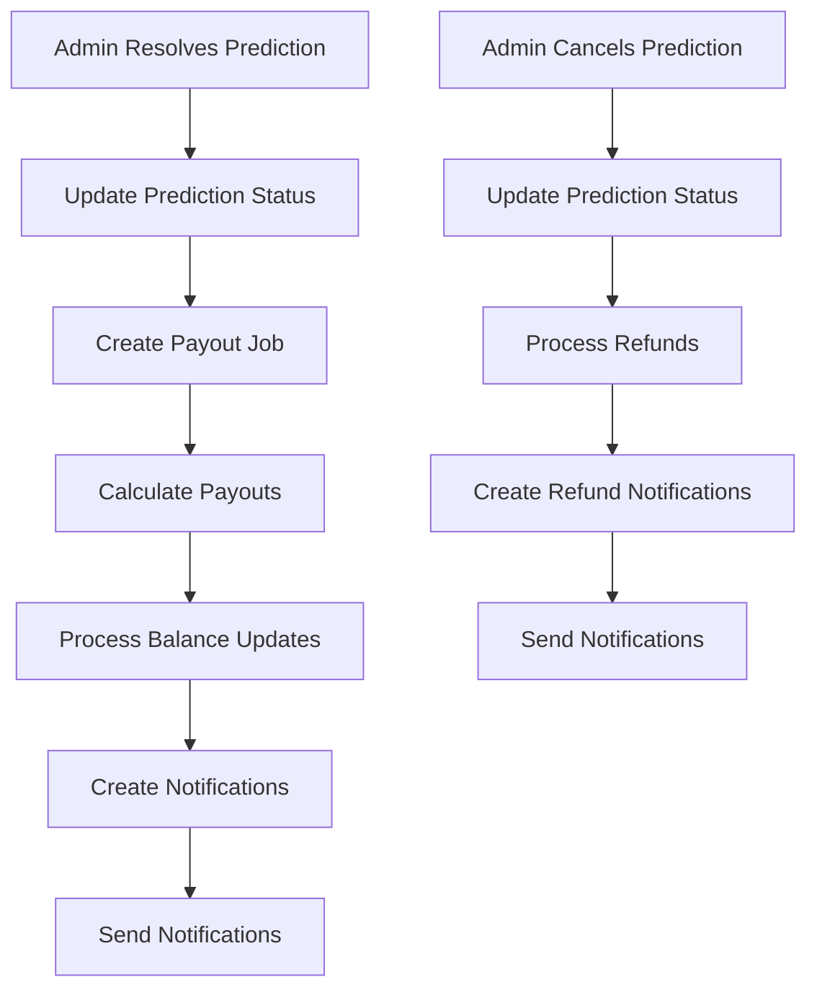

# Prediction Payout System Documentation

## Overview

The Prediction Payout System is a comprehensive solution for managing token-based prediction markets. It handles the calculation and distribution of payouts when predictions are resolved, manages refunds for cancelled predictions, and provides notifications to users about their winnings or losses.

## Architecture

### Core Components

1. **PredictionPayoutService** - Main service for payout calculations and processing
2. **PayoutNotificationService** - Handles user notifications for payout events
3. **API Routes** - REST endpoints for resolving/cancelling predictions
4. **Background Jobs** - Asynchronous payout processing with retry logic

### Data Flow



## Key Features

### 1. Payout Calculation

The system calculates payouts based on a proportional distribution model:

- **Total Pool**: Sum of all committed tokens
- **Winning Pool**: Tokens committed to the winning option
- **Losing Pool**: Tokens committed to losing options
- **House Edge**: 5% of the losing pool (configurable)
- **Distributable Pool**: Losing pool minus house edge

**Formula**: 
```
Winner Payout = Original Tokens + (Distributable Pool × Winner's Share of Winning Pool)
```

### 2. Background Job Processing

- Asynchronous payout processing to handle large numbers of users
- Retry logic with exponential backoff (max 3 retries)
- Job status tracking and monitoring
- Error handling and recovery

### 3. Notification System

- Win/loss/refund notifications
- User preference management
- Multiple notification channels (in-app, email, push)
- Customizable notification messages

### 4. Error Handling

- Comprehensive input validation
- Graceful handling of edge cases
- Transaction rollback capabilities
- Detailed error logging and reporting

## API Endpoints

### Resolve Prediction
```http
POST /api/predictions/{id}/resolve
Content-Type: application/json

{
  "winningOptionId": "option-yes",
  "adminUserId": "admin-123"
}
```

**Response:**
```json
{
  "success": true,
  "predictionId": "prediction-123",
  "winningOptionId": "option-yes",
  "payoutJobId": "job-456",
  "message": "Prediction resolved successfully. Payouts are being processed."
}
```

### Cancel Prediction
```http
POST /api/predictions/{id}/cancel
Content-Type: application/json

{
  "reason": "Technical issues with data source",
  "adminUserId": "admin-123"
}
```

**Response:**
```json
{
  "success": true,
  "predictionId": "prediction-123",
  "reason": "Technical issues with data source",
  "refundResult": {
    "totalProcessed": 25,
    "totalPaidOut": 5000
  },
  "message": "Prediction cancelled successfully. All commitments have been refunded."
}
```

### Get Payout Status
```http
GET /api/predictions/{id}/payout-status
```

**Response:**
```json
{
  "predictionId": "prediction-123",
  "status": "completed",
  "latestJob": {
    "id": "job-456",
    "status": "completed",
    "startedAt": "2024-01-15T10:00:00Z",
    "completedAt": "2024-01-15T10:02:30Z"
  },
  "message": "All payouts have been processed successfully"
}
```

## Database Schema

### Collections

#### `payout_jobs`
```typescript
interface PayoutJobStatus {
  id: string
  predictionId: string
  status: 'pending' | 'processing' | 'completed' | 'failed'
  startedAt: Timestamp
  completedAt?: Timestamp
  result?: PayoutResult
  error?: string
  retryCount: number
  maxRetries: number
}
```

#### `market_outcomes`
```typescript
interface MarketOutcome {
  predictionId: string
  winningOptionId: string
  resolvedAt: Timestamp
  totalPool: number
  winningPool: number
  losingPool: number
}
```

#### `payout_notifications`
```typescript
interface PayoutNotification {
  id: string
  userId: string
  type: 'win' | 'loss' | 'refund'
  predictionId: string
  predictionTitle: string
  tokensCommitted: number
  payoutAmount: number
  winnings?: number
  returnRatio: number
  message: string
  status: 'pending' | 'sent' | 'failed'
  createdAt: Timestamp
  sentAt?: Timestamp
}
```

#### `notification_preferences`
```typescript
interface NotificationPreferences {
  userId: string
  emailNotifications: boolean
  pushNotifications: boolean
  inAppNotifications: boolean
  winNotifications: boolean
  lossNotifications: boolean
  refundNotifications: boolean
}
```

## Usage Examples

### Basic Payout Processing

```typescript
import { PredictionPayoutService } from '@/lib/services/prediction-payout-service'

// Calculate payouts (without processing)
const calculations = await PredictionPayoutService.calculatePayouts(
  'prediction-123',
  'option-yes'
)

// Process payouts with balance updates
const result = await PredictionPayoutService.processPayouts(
  'prediction-123',
  'option-yes'
)

// Create background job for large payouts
const job = await PredictionPayoutService.createPayoutJob(
  'prediction-123',
  'option-yes'
)
```

### Notification Management

```typescript
import { PayoutNotificationService } from '@/lib/services/payout-notification-service'

// Create notifications for payout result
const notifications = await PayoutNotificationService.createPayoutNotifications(
  'prediction-123',
  payoutResult
)

// Get user notifications
const userNotifications = await PayoutNotificationService.getUserNotifications(
  'user-123'
)

// Update notification preferences
const preferences = await PayoutNotificationService.updateNotificationPreferences(
  'user-123',
  { winNotifications: false }
)
```

## Edge Cases Handled

### 1. No Winners
When no one bets on the winning option:
- All losing tokens go to house edge
- No payouts are distributed
- Users receive loss notifications

### 2. Everyone Wins
When everyone bets on the winning option:
- No losing pool to distribute
- Users get back exactly what they committed
- Return ratio is 1.0

### 3. Zero Token Commitments
- Handled gracefully without errors
- No balance updates performed
- Appropriate notifications sent

### 4. Decimal Precision
- All calculations use proper decimal handling
- Rounding applied consistently
- No precision loss in token amounts

### 5. Concurrent Processing
- Optimistic locking prevents race conditions
- Atomic transactions ensure data consistency
- Retry logic handles temporary failures

## Configuration

### Environment Variables
```env
# House edge percentage (default: 0.05 = 5%)
PAYOUT_HOUSE_EDGE=0.05

# Maximum retry attempts for failed jobs
PAYOUT_MAX_RETRIES=3

# Base delay for retry backoff (milliseconds)
PAYOUT_RETRY_DELAY=5000

# Enable notification sending
NOTIFICATIONS_ENABLED=true
```

### Service Configuration
```typescript
// In PredictionPayoutService
private static readonly HOUSE_EDGE = 0.05 // 5%
private static readonly MAX_RETRIES = 3
private static readonly RETRY_DELAY_MS = 5000
```

## Monitoring and Observability

### Metrics to Track
- Payout processing time
- Job success/failure rates
- Notification delivery rates
- Token distribution accuracy
- User engagement with notifications

### Logging
- All payout calculations logged with details
- Job status changes tracked
- Error conditions logged with context
- Performance metrics recorded

### Health Checks
- Job queue health monitoring
- Database connection status
- Notification service availability
- Balance consistency checks

## Security Considerations

### Access Control
- Admin-only endpoints for resolving/cancelling predictions
- User authentication required for notification preferences
- Rate limiting on API endpoints

### Data Validation
- Strict input validation on all endpoints
- Token amount bounds checking
- Prediction state validation before processing

### Audit Trail
- All administrative actions logged
- Payout calculations recorded
- Balance changes tracked with metadata

## Performance Optimization

### Database Optimization
- Indexed queries for fast lookups
- Batch operations for multiple users
- Connection pooling for high throughput

### Caching Strategy
- Prediction data cached during processing
- User preferences cached for notifications
- Job status cached for quick lookups

### Scalability
- Horizontal scaling of background jobs
- Database sharding for large user bases
- CDN for static notification assets

## Testing Strategy

### Unit Tests
- Payout calculation logic
- Notification message generation
- Input validation functions
- Error handling scenarios

### Integration Tests
- Complete payout flow testing
- Database transaction testing
- API endpoint testing
- Notification delivery testing

### Load Testing
- Concurrent payout processing
- High-volume notification sending
- Database performance under load
- API response times

## Troubleshooting

### Common Issues

#### Payout Job Stuck in Processing
```bash
# Check job status
GET /api/predictions/{id}/payout-status

# Manually retry failed job
POST /api/admin/payout-jobs/{jobId}/retry
```

#### Balance Inconsistencies
```typescript
// Run balance reconciliation
const result = await TokenBalanceService.reconcileUserBalance(userId)
```

#### Notification Delivery Failures
```typescript
// Check notification status
const notifications = await PayoutNotificationService.getUserNotifications(userId)

// Resend failed notifications
await PayoutNotificationService.resendFailedNotifications(userId)
```

### Debug Mode
Enable detailed logging by setting:
```env
DEBUG_PAYOUTS=true
LOG_LEVEL=debug
```

## Future Enhancements

### Planned Features
1. **Multi-currency Support** - Handle different token types
2. **Advanced Payout Models** - Implement different distribution algorithms
3. **Real-time Notifications** - WebSocket-based instant notifications
4. **Analytics Dashboard** - Comprehensive payout analytics
5. **Automated Testing** - Continuous integration testing

### Performance Improvements
1. **Batch Processing** - Process multiple predictions simultaneously
2. **Caching Layer** - Redis caching for frequently accessed data
3. **Queue Optimization** - Priority-based job processing
4. **Database Optimization** - Advanced indexing and partitioning

## Support and Maintenance

### Regular Maintenance Tasks
- Monitor job queue health
- Review error logs and patterns
- Update notification templates
- Optimize database queries
- Review security configurations

### Emergency Procedures
- Rollback failed payouts
- Pause payout processing
- Emergency notification broadcasts
- Data recovery procedures

For technical support or questions about the payout system, please refer to the development team or create an issue in the project repository.